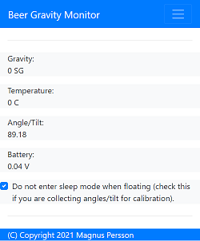
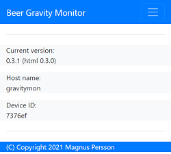
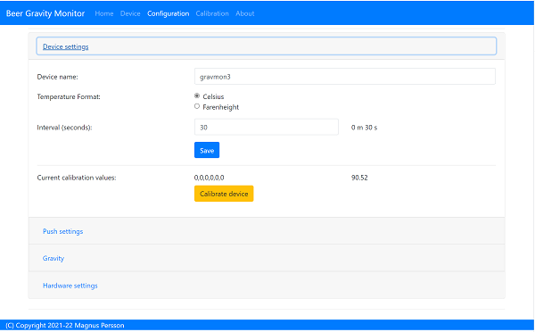
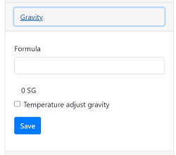
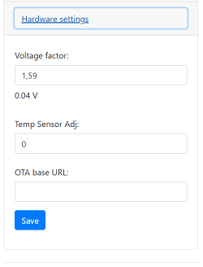

# Gravity Monitor for Beer Brewing

I started this project out of curiosity for how a motion sensor is working and since I like to brew beer this was the result. This software can be used with iSpindle hardware and utilizes the same hardware configuration. No code has been reused from the iSpindle project. 

## TODO

* Add support for Plato in device (today it assumes that formula is in SG). 
* Add support for converting between SG/Plato in device.
* Add support for Blynk as endpoint
* Add support for https connections (push) - [need to reduce memory usage for this to work, gets out of memory error]
* Add support for https web server (will require certificates to be created as part of build process)
* Add iSpindle 3D print cradle + small PCB (what I use for my builds)
* [done] Validate max sleep time to 70 min (max time for ESP)
* Validate the power consumption of the device using amp meter (integrated and/or separate)
* [done] Add option to use temperature readings from motion sensor (longer battery life)
* [done] When using temp from motion sensor the value should be the initial read or the value will not be accurate.
* Testing, Testing and more testing......

# Functionallity

I have made a few different design decision compared to the standard iSpindle software. 

* The device operate in two modes, __always-on__ or __deep-sleep__. Always on can be triggered in two ways: Connected to charger and the power is over 4.1V or the device is lying flat (angle is approx 90 degrees). 

* Configuration options have been moved to a web gui and is accesible when the device is in __always-on__ mode. The Wifi portal only need to be used for changing WIFI network. 

* The software also has built in OTA support so new versions can be downloaded from a local webserver and checks are done during startup and the device is in __always-on__ mode.

* Temperature calibration has been added for the DS18B20 sensor so you can adjust the temperature sensor readings if there is a need. When the device is in __always-on__ mode the temperature will rise in the container so the value will increase and not reflect the temperature for the surronding the container.

* There is an option to automatically correct the gravity calculation based on the temperature. Useful if you are fermenting at lower temperatures. It's possible to build this into the normal gravity formula but this is an easier option. Just make sure that the calibration is done at 20°C.

* The software will read the motion sensor 50 times and use the average to calculate the angle. If the readings show that the device is moving it will wait a few seconds and retry the operation again to make sure that no invalid angles should be reported. If the device is unsuccesful to get a valid angle within 10s it will go to sleep for 60s and then retry again (TODO: This will be adjusted after more testing).

## Configuration 

Configuration is accessed by entering the URL for the device, this will be the mDNS name __device.local__ or the IP adress. The following chapter assumes the device name is __gravmon__.

### Index page

http://gravmon.local/

The main page shows the device readings; gravity, angle, temperature and battery charge. If the checkbox is active then the device will never go into sleep mode. This is useful if you are collecting angle/tilt for calibration. If this is unchecked the device will change mode as explained before.



### Device page

http://gravmon.local/device.htm

The device page shows the device settings and software versions. 



### Config page

http://gravmon.local/config.htm

* This page is divided into several categories of settings. The first one contains device settings, mDNS name, temperature format, sleep interval and gyro calibration data. The interval setting is the amount of time the device will be in sleep mode between readings (interval is in seconds). To simplify this you can also see the conversion to minutes / seconds next to the input field.

* The sleep interval can be set between 10 - 3600 seconds (60 minutes). 

* Calibration needs to be done or the device will not work correctly. Place the device flat on a surface with gyro up and press the calibrate button when it's stable. If no calibration data exist the device will not enter sleep-mode.



* The second section contains the push settings, two URL's for http posts, Brewfather and settings for InfluxDB v2. 

### This is the format used for standard http posts. 
```
{ 
   "name" : "gravmon",      // mDNS name
   "ID": "2E6753",          // esp device id
   "token" : "gravmon",
   "interval": 900,     
   "temperature": 20.5,     // C or F based on setting, adjusted value.
   "temp-units": "C",       // C or F based on setting
   "gravity": 1.0050,       // 
   "angle": 45.34,
   "battery": 3.67,
   "rssi": -12,
   "run-time": 230,         // ms, Runtime for this reading, this is an additional field not part of the standard format
}
```

### This is the format for Brewfather

```
{ 
   "name" : "gravmon",      // mDNS name
   "temp": 20.5,
   "temp-unit": "C",
   "battery": 3.67,
   "gravity": 1.0050,
   "gravity_unit": "G",     // G = SG, Plato is not yet supported
}
```

### This is the format for InfluxDB v2

```
measurement,host=<mdns>,device=<id>,temp-format=<C|F>,gravity-format=SG gravity=1.0004,angle=45.45,temp=20.1,battery=3.96,rssi=-18
```


* The third section contains the gravity formula and also option for doing temperature compensation. The calibration formula uses two keywords, temp and tilt. Temperature is in the selected device format. 

* Gravity formula is compatible with standard iSpindle formulas so any existing calculation option can be used. I use the tool fermentrack for controlling my fermentation and I use this tool for calculating gravity. The formula can handle two keywords, __tilt__ and __temp__. This is an example of a formula; __0.00145*tilt^3+0.1445*tilt^2+0.00179*tilt+0.9436__ 

* This is the formula used for temperature calibration (temp is in F). Cal = 20C.
```
gravity*((1.00130346-0.000134722124*temp+0.00000204052596*temp^2-0.00000000232820948*temp^3)/(1.00130346-0.000134722124*cal+0.00000204052596*cal^2-0.00000000232820948*cal^3))
```


* Hardware settings contain settings for temperature sensor adjustment, voltage factor (to calulate the battery level) and OTA URL.

* For the OTA to work, place the following files (version.json + firmware.bin) at the location that you pointed out in OTA URL. If the version number in the json file is newer than in the code the update will be done during startup.

Example; OTA URL (don't forget trailing dash), the name of the file should be firmware.bin
```
http://192.168.1.1/firmware/gravmon/
```

Contents version.json
```
{ "project":"gravmon", "version":"0.3.0" }
```



# Building a device

See the iSpindle documentation for building a device. 

# Compiling the software

I recommend that VSCODE with PlatformIO and Minfy extensions are used. Minify is used to reduce the size of the HTML files which are embedded into the firmware or uploaded to the file system. When using minify on a file, for example index.htm the output will be called index.min.htm. This is the file that will be used when buildning the image. 

By default the html files are embedded but there are options to upload them to the file system to reduce the size of the image if the size becomes to large for OTA. 

You can set the SSID and PWD as presets through platformio.ini by adding the settings to the following definitions:
```
-D USER_SSID=\""\""           // =\""myssid\""
-D USER_SSID_PWD=\""\""       // =\""mypwd\""
```

There are more options in teh platform.ini file that enable/disable additional functions for logging level, pushing performance data to InfluxDB and more. If i get the time I will add some documentation around these. 