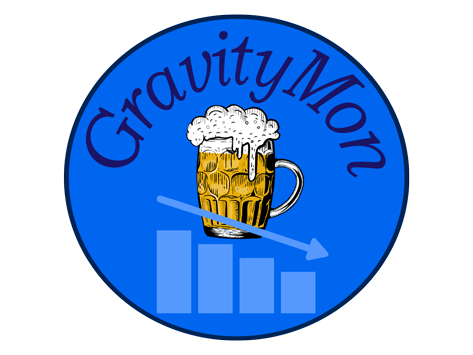

 

# Gravity Monitor for Beer Brewing

GravityMon is a replacement firmware for the iSpindle firmware. It's 100% compatible with the iSpindle hardware design so it does not require any hardware changes. 

Now also works with ESP32 c3 mini, ESP32 S2 mini, ESP32 S3 mini which are pin compatible with ESP8266.

Installation can be made using https://www.brewflasher.com or the web version at https://web.brewflasher.com

The documentation can be found here: https://www.gravitymon.com/docs.html

Visit the gravitymon homepage here for more information about the project: https://www.gravitymon.com

If you want to support my work you can do that through these options

 

# Supporters

Thanks to the following persons for supporting me and this project:

* David Conde, @davidconde
* Lars H.
* Vonchilliman
* Andreas Dohl
* StodgyWaif

