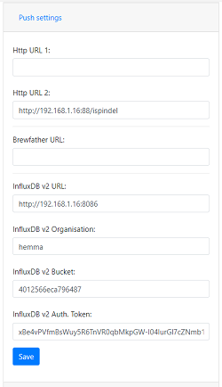

Configuration
-----------------------
The device can operate in two modes and must be in `configuration mode` in order for the web server to be active.

One of the following conditions will place the device in `configuration mode`:

- Gyro has not been calibrated
- Sleep mode has been disabled in the web interface
- Placed in horizontal mode 85-90 degrees
- Charger connected >4.15V

Main index
==========

URL: (http://gravmon.local)

Configuration is accessed by entering the URL for the device, this will be the mDNS name *device.local* or the IP adress. The following chapter assumes the device name is *gravmon*.

The main page shows the device readings; gravity, angle, temperature and battery charge. If the checkbox is active then the device will never go into sleep mode. This is useful if 
you are collecting angle/tilt for calibration. If this is unchecked the device will change mode as explained before.

.. note::

   If you are connected to the device via a serial console (speed: 115200) you can see the connection sequence and get the Unique ID and IP adress from there. 

Device
======

URL: (http://gravmon.local/device)

.. image:: images/device.png
  :width: 400
  :alt: Device Settings

* **Version:** 

   Installed version of the code and html files.

* **Device name:** 

   This is unique name of the device. 

* **Device ID:** 

   This is unique identifier for the device (ESP8266 id), this is required when using the API as an API Key to safeguard against faulty requests.

Configuration 
=============

URL: (http://gravmon.local/config)

Device Setting
**************

.. image:: images/config1.png
  :width: 400
  :alt: Device Settings

* **Device name:** 

   This is unique name for the device. It will be used in pushing data as well as mDNS name on the network (<name>.local)

* **Temperature format:** 

   Choose between Celsius and Farenheight

* **Interval:** 

   This defines how long the device should be sleeping between the readings when in `gravity monitoring` mode. You will also see the values in minutes/seconds to easier set the interval. 900s is a recommended interval.

.. note::

   The sleep interval can be set between 10 - 3600 seconds (60 minutes). 

* **Calibration values:** 

   These are calibration data for the gyro. Place the device flat on a table and press the button to save the default orientation values. Without this calibration we cannot calculate the correct angle/tilt.

.. note::

   The device will **not** go into `gravity monitoring` mode unless calibrated

Push Settings
*************

* **HTTP URL 1:**

   Endpoint to send data via http. Format used is standard iSpindle format (see format section).

* **HTTP URL 2:**

   Endpoint to send data via http. Format used is standard iSpindle format (see format section).

* **Brewfather URL:**

   Endpoint to send data via http to brewfather. Format used is defined by brewfather (see format section).

* **Influx DB v2 URL:**

   Endpoint to send data via http to InfluxDB. For format (see format section).

* **Influx DB v2 Organisation:**

   Name of organisation in Influx.

* **Influx DB v2 Bucket:**

   Identifier for bucket.

* **Influx DB v2 Token:**

   Token with write access to bucket.

Gravity Settings
****************

.. image:: images/config3.png
  :width: 400
  :alt: Gravity Settings

* **Gravity formula:**

   Gravity formula is compatible with standard iSpindle formulas so any existing calculation option can be used. Is updated if the calibration function is used.

* **Temperature correct gravity:**

   Will apply a temperature calibration formula to the gravity as a second step. 

   This is the formula used for temperature calibration (temp is in F). Cal = 20C.

::

   gravity*((1.00130346-0.000134722124*temp+0.00000204052596*temp^2-0.00000000232820948*temp^3)/(1.00130346-0.000134722124*cal+0.00000204052596*cal^2-0.00000000232820948*cal^3))

Hardware Settings
*****************

.. image:: images/config4.png
  :width: 400
  :alt: Hardware Settings

* **Voltage factor:**

   Factor used to calcualate the battery voltage. If you get a too low/high voltage you can adjust this value.

* **Temperature correction:**

   This value will be added to the temperature reading (negative value will reduce temperature reading).

* **OTA URL:**

   Should point to a URL where the .bin file + version.json file is located. 

   For the OTA to work, place the following files (version.json + firmware.bin) at the location that you pointed out in OTA URL. If the version number in the json file is newer than in the 
   code the update will be done during startup.

   Example; OTA URL (don't forget trailing dash), the name of the file should be firmware.bin

::
  
   http://192.168.1.1/firmware/gravmon/

  

   Contents version.json

::

   { "project":"gravmon", "version":"0.5.0" }

Create formula
=============================
todo

REST API
=============================
todo

Data Formats
=============================

iSpindle format 
***************

This is the format used for standard http posts. 

::

   { 
      "name" : "gravmon",      // mDNS name
      "ID": "2E6753",          // esp device id
      "token" : "gravmon",
      "interval": 900,     
      "temperature": 20.5,     // C or F based on setting, adjusted value.
      "temp-units": "C",       // C or F based on setting
      "gravity": 1.0050,       // Raw or temperature corrected gravity (based on setting)
      "corr-gravity": 1.0050,  // Temperature corrected gravity 
      "angle": 45.34,
      "battery": 3.67,
      "rssi": -12,

      // Extension fields
      "run-time": 230,         // ms, Runtime for this reading, this is an additional field not part of the standard format
   }
   

Brewfather format 
******************

This is the format for Brewfather

::

   { 
      "name" : "gravmon",      // mDNS name
      "temp": 20.5,
      "temp-unit": "C",
      "battery": 3.67,
      "gravity": 1.0050,
      "gravity_unit": "G",     // G = SG, Plato is not yet supported
   }

Influx DB v2
************

This is the format for InfluxDB v2

::
   
   measurement,host=<mdns>,device=<id>,temp-format=<C|F>,gravity-format=SG,gravity=1.0004,corr-gravity=1.0004,angle=45.45,temp=20.1,battery=3.96,rssi=-18
   
