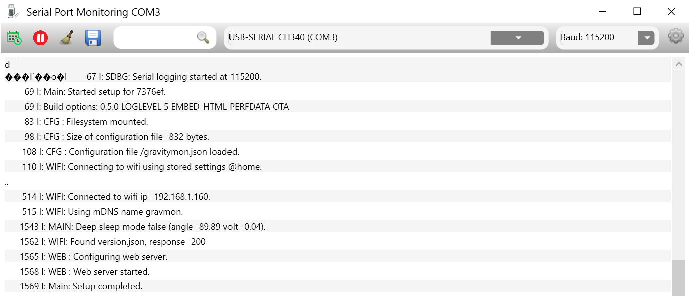
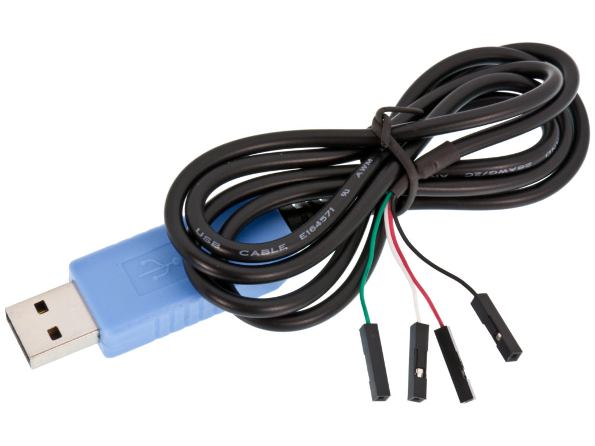
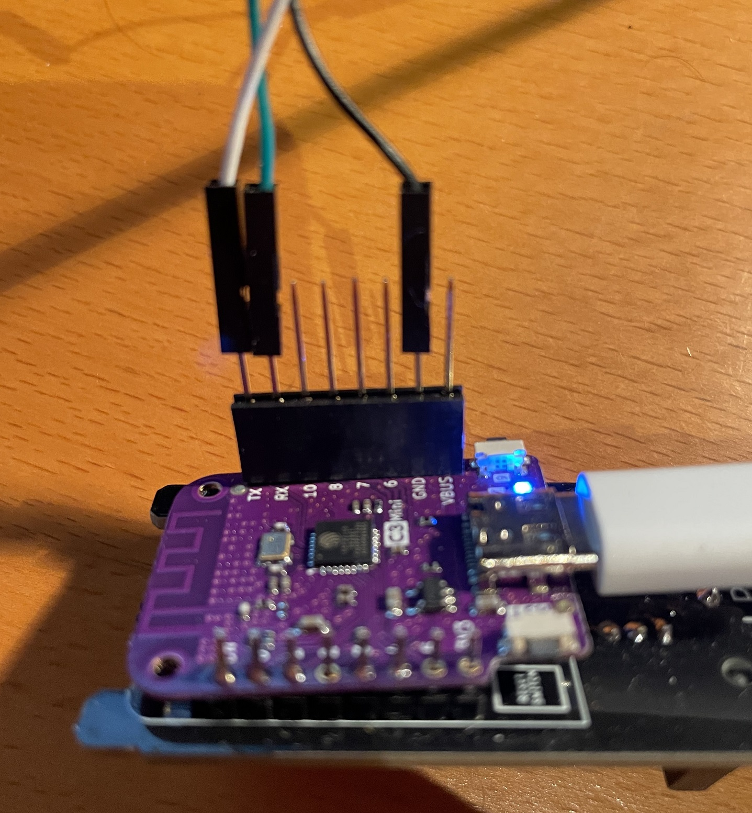

.. _compiling-the-software:

Compiling the software
######################

Tools
=====
I use the following tools in order to build and manage the software:

* Visual Studio Code
* PlatformIO
* Git for Windows
* Python3 (for building docs)

Code Formatting
===============
I use pre-commit and their cpp style checks to validate the code. Plugin defintions are found in **.pre-commit-config.yaml**

`Pre-Commit <https://www.pre-commit.com>`_

.. note::

  There is not yet any automatic checks since this does not work on Windows. It works if running under WSL2 
  with Ubuntu or on MacOS.

Targets 
=======
In the platformio config there are a number of targets defined, each for a specific board.

Serial debugging on battery
===========================

On the ESP32 builds the serial output can be  written to UART0 which is connected to the RX/TX pins on the chip. This way the serial output can be viewed 
without a connection to the USB port, convinient when running the device on battery power. In order to get this to work you need to compile the sofware 
with the option **DUSE_SERIAL_PINS** and attach as USB to TTL cable to the correct pins. 

You connect the USB to TTL cable that you connect the TX, RX and GND pins. **Dont connect the power pin** if you are powering the device from USB or Battery.

Source structure 
================
.. list-table:: Directory structure
   :widths: 40 60
   :header-rows: 1

   * - path
     - content
   * - /.github
     - Automated github action workflows
   * - /bin
     - Contains compiled binaries
   * - /html
     - Pre-built ui assets embedded into firmware (index.html, app.js.gz, app.css.gz, favicon.ico.gz)
   * - /lib
     - Local library copies (ds18b20_checker, mpu6050, tinyexpr)
   * - /script
     - Python build scripts run by PlatformIO (board flags, firmware copy, version JSON, git revision)
   * - /src
     - Firmware source code
   * - /src_docs
     - Sphinx documentation source
   * - /test
     - AUnit on-device unit tests (tests*.cpp) and Python API integration tests (scripts/)
