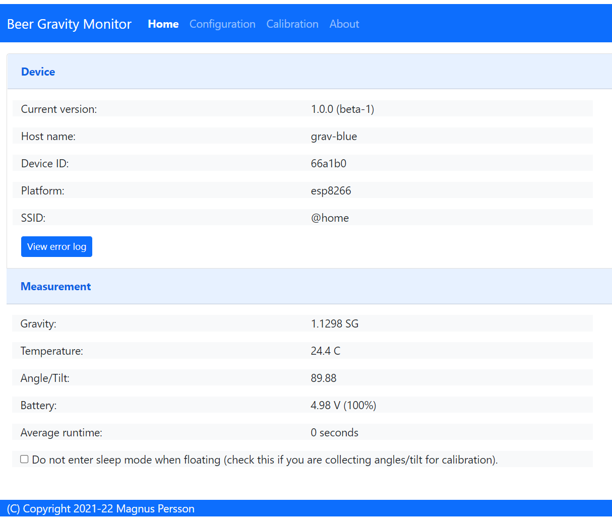
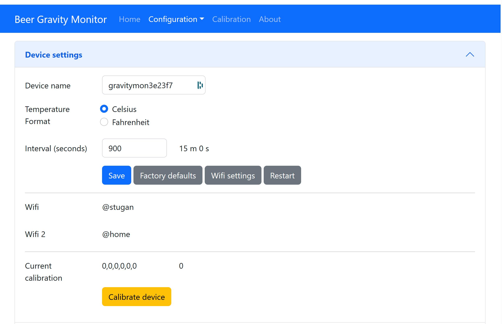
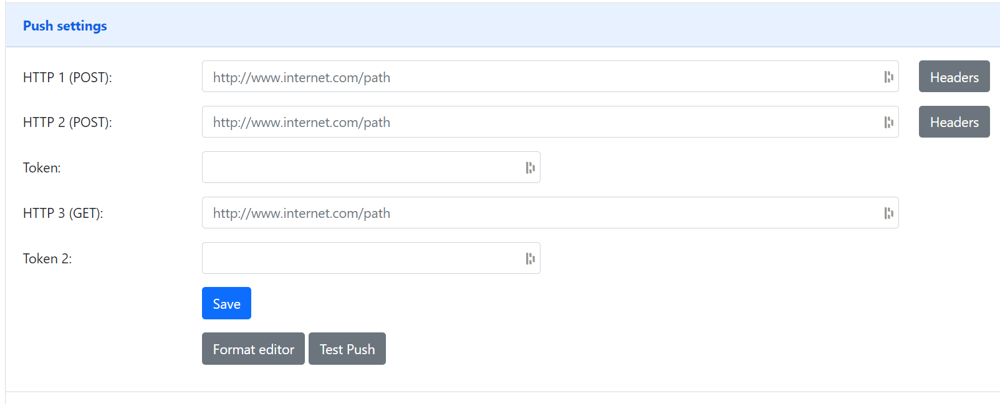
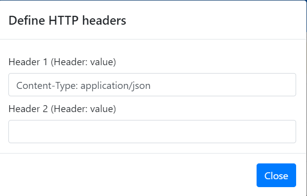
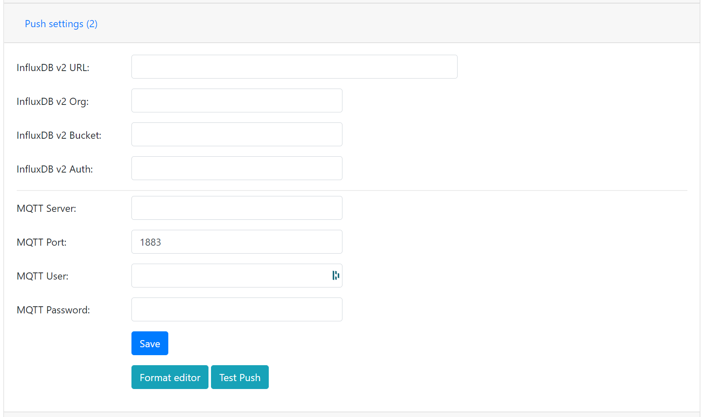
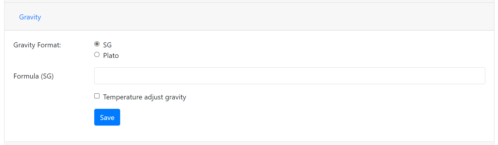
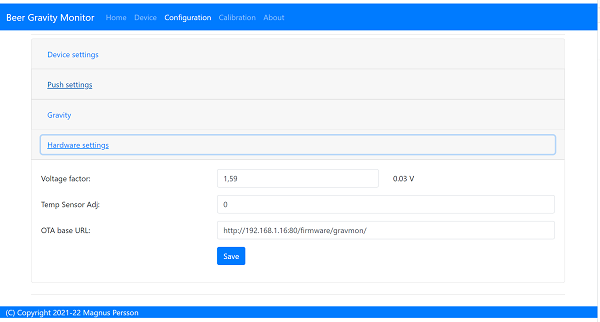
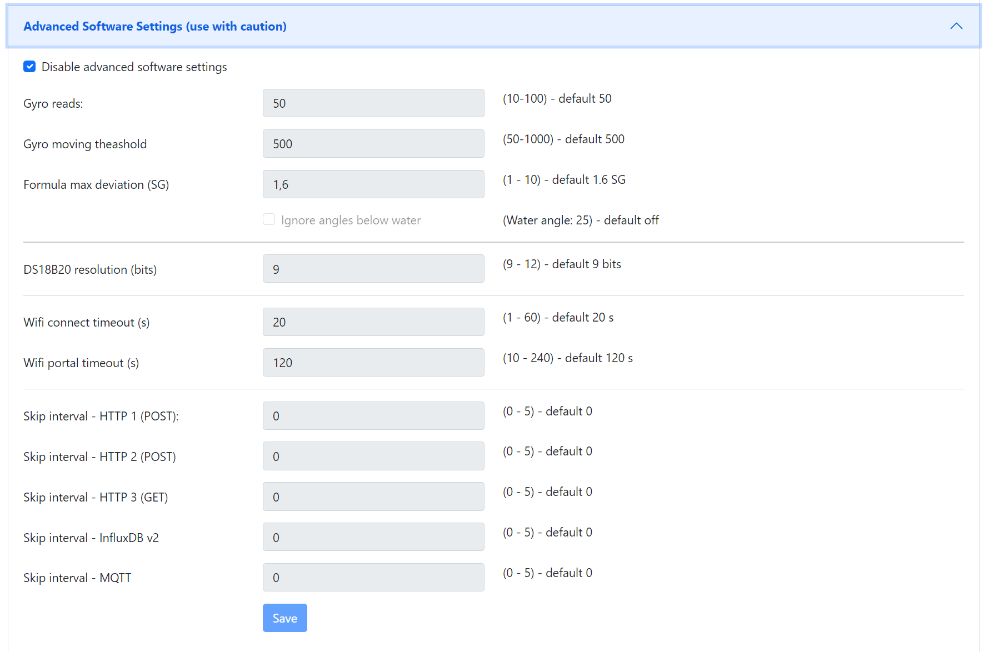

.. _setting-up-device:

Configuration
#############

The device can operate in two modes and must be in ``configuration mode`` in order for the web server to be active.

One of the following conditions will place the device in ``configuration mode``:

- Gyro has not been calibrated
- Sleep mode has been disabled in the web interface
- Placed in horizontal mode 85-90 degrees
- Charger connected >4.15V (or the value that is configured)

Status 
======

URL: (http://gravmon.local)

Configuration is accessed by entering the URL for the device, this will be the mDNS name *device.local* or the IP address. The following chapter assumes the device name is *gravmon*.

The main page shows the device readings; gravity, angle, temperature and battery charge. If the checkbox is active then the device will never go into sleep mode. This is useful if 
you are collecting angle/tilt for calibration. If this is unchecked the device will change mode as explained before.

You can also view the average time a gravity measurement takes. Under optimal setting this should be around 1.5 - 2.0 seconds. If this is higher than 2 seconds this is most likely connected to slow wifi 
connection. It will show 0 if data has not been collected yet.

.. tip::

   If you are connected to the device via a serial console (speed: 115200) you can see the connection sequence and get the Unique ID and IP address from there. 

.. tip::

   The button `view error log` will show the last error messages on the device. This can be useful for checking errors without
   the need to connect to the serial port or to check what errors has occurred while in `gravity mode`. From v1.1 it will also detect
   any abnormal restarts or crashes and record these in the logfile (this applies to esp8266 only). 

Configuration 
=============

URL: (http://gravmon.local/config)

Device Setting
++++++++++++++

* **Device name:** 

This is unique name for the device. It will be used in pushing data as well as mDNS name on the network (<name>.local). 
The limitation is 63 chars but using long names might break endpoints that data is sent to if they have other limitations. 

* **Temperature format:** 

Choose between Celsius and Fahrenheit when displaying temperature. 

* **Interval:** 

This defines how long the device should be sleeping between the readings when in `gravity monitoring` mode. You will also see 
the values in minutes/seconds to easier set the interval. 900s is a recommended interval.  The sleep interval can 
be set between 10 - 3600 seconds (60 minutes). 

.. note::

   A low value such as 30s will give a lifespan of 1-2 weeks and 300s (5 min) would last for 3+ weeks. This assumes that 
   there is good wifi connection that takes less than 1s to reconnect. Poor wifi connection is the main reason for battery drain. 
   The device will show the estimated lifespan based on the average connection time, if no data exist it will not be shown.
   

* **Calibration values:** 

These are calibration data for the gyro. Place the device flat on a table and press the button to save the default orientation values. Without this calibration we cannot calculate the correct angle/tilt.

.. warning::

   The device will **not** go into `gravity monitoring` mode unless calibrated

Push Settings
+++++++++++++

.. note::

   When enabling SSL this will not validate the root CA of the remote service, this is a design decision based on two aspects. Enabling CA validation will take 3-4s extra on each connection which means way less 
   battery life, so the decision is to prioritize battery life over security. The data transmitted is not really that sensitive anyway so I believe this is a good balance.

* **HTTP 1 (POST):**

Endpoint to send data via http. Default format used Format used :ref:`data-formats-ispindle`. You can customize the format using :ref:`format-editor`.

If you add the prefix `https://` then the device will use SSL when sending data.

* **HTTP 2 (POST):**

Endpoint to send data via http. Default format used :ref:`data-formats-ispindle`. You can customize the format using :ref:`format-editor`.

If you add the prefix `https://` then the device will use SSL when sending data. 

* **Token:**

The token is included in the iSpindle JSON format and will be used for both HTTP targets. If you 
need to have 2 different tokens please use the :ref:`format-editor` to customize the data format. 

* **HTTP 3 (GET):**

Endpoint to send data via http. This is using an HTTP GET request instead of a post. This means that the values are appended to the URL like; http://endpoint?param=value&param2=value2. You can customize the format using :ref:`format-editor`.

If you add the prefix `https://` then the device will use SSL when sending data. 

* **Token 2:**

The token is included in the default format for the HTTP GET url but can be used for any of the formats. For HTTP GET use can use this for an authorization token with for instance ubidots or blynk http api. 

* **HTTP Headers**

You can define 2 http headers per push target. This is available via a pop-up window but don't forget
to press the save buttons on the post section to save the values. One common header is content type which is the 
default setting for http targets.

The input must have the format **'<header>: <value>'** for it to work. The UI will accept any value so errors 
will not show until the device tries to push data.

::
   
   Content-Type: application/json
   X-Auth-Token: <api-token>

Mozilla has a good guide on what headers are valid; `HTTP Headers <https://developer.mozilla.org/en-US/docs/Web/HTTP/Headers>`_ 

Push Settings (2)
+++++++++++++++++

* **Influx DB v2 URL:**

Endpoint to send data via http to InfluxDB. Format used :ref:`data-formats-influxdb2`. You can customize the format using :ref:`format-editor`.

SSL is not supported for this target. Raise a issue on github if this is wanted.

* **Influx DB v2 Organisation:**

Name of organisation in Influx.

* **Influx DB v2 Bucket:**

Identifier for bucket.

* **Influx DB v2 Token:**

Token with write access to bucket.

* **MQTT server:**

IP or name of server to send data to. Default format used :ref:`data-formats-mqtt`. You can customize the format using :ref:`format-editor`.

* **MQTT Port:**

Which port should be used for communication, default is 1883 (standard port). For SSL use 8883 (any port over 8000 is treated as SSL). 

* **MQTT user:**

Username or blank if anonymous is accepted

* **MQTT password:**

Password or blank if anonymous is accepted
   

Gravity Settings
++++++++++++++++

* **Gravity format:**

Gravity format can be either `SG` or `Plato`. The device will use SG Internally and convert to Plato when displaying or sending data.

* **Gravity formula:**

Gravity formula is compatible with standard iSpindle formulas so any existing calculation option can be used. You can also use 
the feature to create the formula by supplying the raw data. See :ref:`create-formula`

The gravity formula accepts to parameters, **tilt** for the angle or **temp** for temperature (temperature inserted into the formula 
will be in celsius). I would recommend to use the formula calculation feature instead since this is much easier.

* **Temperature correct gravity:**

Will apply a temperature calibration formula to the gravity as a second step after gravity has been calculated. It's also possible to 
build this into the gravity formula.

.. warning::

   This formula assumes that the calibration has been done at 20°C / 68°F.

   Formula used in temperature correction. The calibration temperature can be changed under advanced settings. 

::

   gravity*((1.00130346-0.000134722124*temp+0.00000204052596*temp^2-0.00000000232820948*temp^3)/
   (1.00130346-0.000134722124*cal+0.00000204052596*cal^2-0.00000000232820948*cal^3))

Hardware Settings
+++++++++++++++++

* **Voltage factor:**

Factor used to calculate the battery voltage. If you get a too low/high voltage you can adjust this value.

* **Config voltage:**

Defines the level of voltage when the device should enter config mode due to charging. This might vary between different battery manufacturers. 
If you don't what the device to go into configuration mode when charging, set this to 6V. This was added since different batteries have different 
voltages when fully charged. 

* **Temperature correction:**

This value will be added to the temperature reading (negative value will reduce temperature reading). This is applied
when the device starts. So changing this will not take affect until the device is restarted.

* **Gyro Temperature:**

Enable this feature will use the temp sensor i the gyro instead of the DS18B20, the benefit is shorter run time and
longer battery life (this is an experimental feature). The value used is the first temperature reading from when the 
device is activated, since the gyro should be cool this is reflecting the surrounding temperature. After it has 
been running the value would be totally off.  

* **Enable storage mode when placed on cap**

When place on the cap (<5 degree tilt) the device will go into deep sleep forever (until reset). In order to wake it 
up you need to do a reset. One option is to attach a magnetic reed switch (default open) to the reset pin and use a 
magnet to force a reset without opening the tube. The reed switch is typically an electronic component of 14 mm 
long encapsulated in a small glass tube. See hardware section for more information, :ref:`hardware`.

* **Bluetooth: (Only ESP32)**

If the build is using an ESP32 then you can send data over BLE, simulating a Tilt device. Choose the color that you want the device to simulate.

* **OTA URL:**

Should point to a URL where the firmware.bin file + version.json file are located. For an ESP32 target the firmware should be named firmware32.bin.

For the OTA to work, place the following files (version.json + firmware.bin) at the location that you pointed out in OTA URL. If the version number in the json file is newer than in the 
code the update will be done during startup.

If you have the previx `https://` then the device will use secure transfer without CA validation.

Example; OTA URL (don't forget trailing dash), the name of the file should be firmware.bin

.. code-block::

   http://192.168.1.1/firmware/gravmon/
   https://192.168.1.1/firmware/gravmon/

* **Upload Firmware**

This option gives you the possibility to install an new version of the firmware (or any firmware that uses the standard flash layout).

.. image:: images/firmware.png
  :width: 600
  :alt: Update firmware

Advanced Settings
+++++++++++++++++

.. warning::

   Change these parameters with caution. The wrong values might cause the device to become unresponsive. 

* **Gyro reads:**

This defines how many gyro reads will be done before an angle is calculated. More reads will give better accuracy and also allow detection of 
movement. Too many reads will take time and affect battery life. 50 takes about 800 ms to execute.

* **Gyro moving threshold:**

This is the max amount of deviation allowed for a stable reading. 

* **Formula deviation:**

This is the maximum deviation on the formula allowed for it to be accepted. Once the formula has been derived it will be validated against the supplied 
data and of the deviation on any point is bigger the formula will be rejected.

* **Ignore angles below water:**

If this option is checked any angles below that of SG 1 will be discarded as invalid and never sent to any server. Default = off.

* **Gravity calibration temp**

This option allows you to set the correction temperature used in the automatic temperature gravity adjustment formula. Standard is 20C. 

* **DS18B20 Resolution:**

Define the resolution used on the temp sensor. 9 bits is default and will give an accuracy of 0.5C, 12 bits will give an accuracy of 0.0625C but will also 
take longer time to measure..
   
* **Wifi connect timeout:**

This is the amount of time allowed for a wifi connect. 
   
* **Wifi portal timeout:**

If the wifi portal is triggered (can be triggered by reset) then this is the amount of time allowed before it exists again.
   
* **Skip Interval (...):**

These options allow the user to have variable push intervals for the different endpoints. 0 means that every wakeup will send data to that endpoint. If you enter another number then that defines how many sleep cycles will be skipped.

If the sleep interval is 300s and MQTT is set to 0 and HTTP1 is set to 2 then MQTT will be sent every 300s while HTTP1 would be sent 900s. This is great if you want to send data to a local mqtt server often but brewfather will only 
accept data every 15 min.
