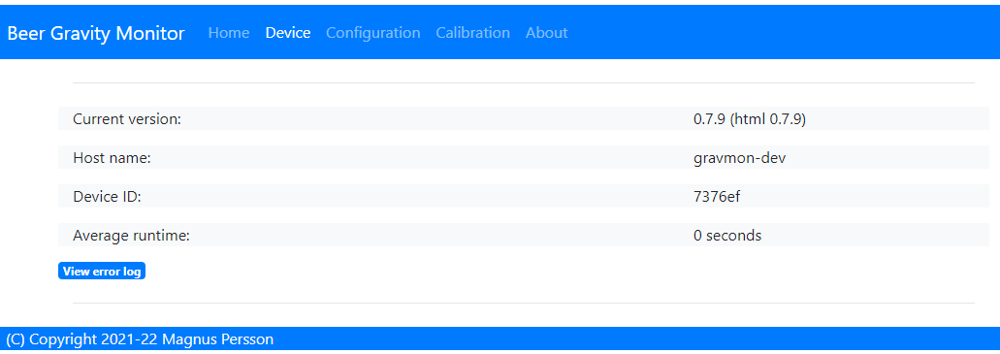
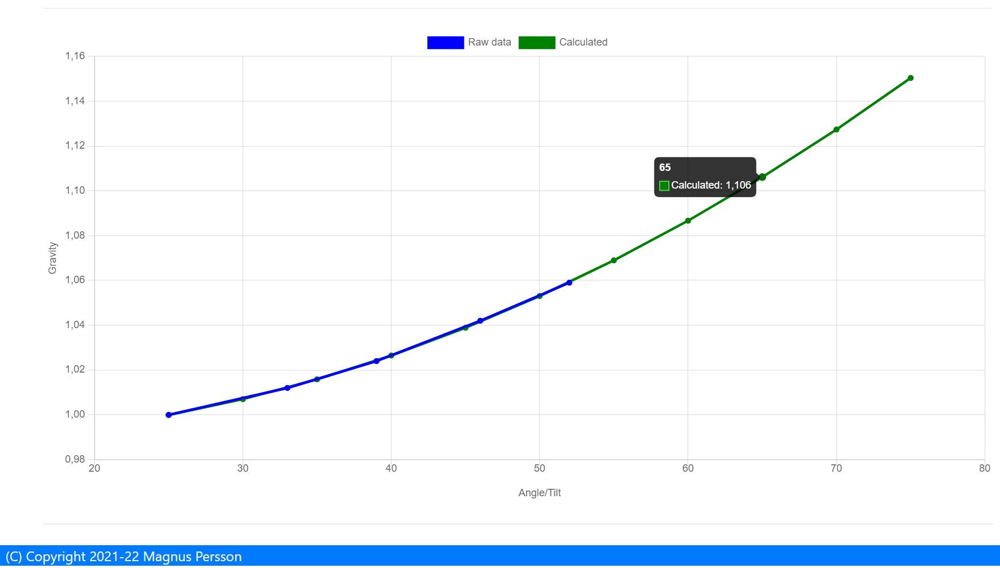

.. _setting-up-device:

Setting up device
#################

The device can operate in two modes and must be in ``configuration mode`` in order for the web server to be active.

One of the following conditions will place the device in ``configuration mode``:

- Gyro has not been calibrated
- Sleep mode has been disabled in the web interface
- Placed in horizontal mode 85-90 degrees
- Charger connected >4.15V

Status 
======

URL: (http://gravmon.local)

.. image:: images/index.png
  :width: 800
  :alt: Index page

Configuration is accessed by entering the URL for the device, this will be the mDNS name *device.local* or the IP adress. The following chapter assumes the device name is *gravmon*.

The main page shows the device readings; gravity, angle, temperature and battery charge. If the checkbox is active then the device will never go into sleep mode. This is useful if 
you are collecting angle/tilt for calibration. If this is unchecked the device will change mode as explained before.

.. tip::

   If you are connected to the device via a serial console (speed: 115200) you can see the connection sequence and get the Unique ID and IP adress from there. 

Device
======

URL: (http://gravmon.local/device)

* **Version:** 

   Installed version of the code and html files.

* **Device name:** 

   This is unique name of the device. 

* **Device ID:** 

   This is unique identifier for the device (ESP8266 id), this is required when using the API as an API Key to safeguard against faulty requests.

Configuration 
=============

URL: (http://gravmon.local/config)

Device Setting
++++++++++++++

.. image:: images/config1.png
  :width: 800
  :alt: Device Settings

* **Device name:** 

   This is unique name for the device. It will be used in pushing data as well as mDNS name on the network (<name>.local)

* **Temperature format:** 

   Choose between Celsius and Farenheight

* **Interval:** 

   This defines how long the device should be sleeping between the readings when in `gravity monitoring` mode. You will also see the values in minutes/seconds to easier set the interval. 900s is a recommended interval.

.. note::

   The sleep interval can be set between 10 - 3600 seconds (60 minutes). 

* **Calibration values:** 

   These are calibration data for the gyro. Place the device flat on a table and press the button to save the default orientation values. Without this calibration we cannot calculate the correct angle/tilt.

.. warning::

   The device will **not** go into `gravity monitoring` mode unless calibrated

Push Settings
+++++++++++++

.. image:: images/config2.png
  :width: 800
  :alt: Push Settings

.. note::

   When enabling SSL this will not validate the root CA of the remote service, this is a design decision based on two aspects. Enabling CA validation will take 3-4s extra on each connection which means way less 
   battery life, so the decision is to prioritize battery life over security. The data transmitted is not really that sensitive anyway so I belive this is a good balance.

* **HTTP URL 1:**

   Endpoint to send data via http. Format used Format used :ref:`data-formats-ispindle`

   If you add the prefix `https://` then the device will use SSL when sending data.

* **HTTP URL 2:**

   Endpoint to send data via http. Format used :ref:`data-formats-ispindle`

   If you add the prefix `https://` then the device will use SSL when sending data. 

* **Brewfather URL:**

   Endpoint to send data via http to brewfather. Format used :ref:`data-formats-brewfather`

   SSL is not supported for this target.

* **Influx DB v2 URL:**

   Endpoint to send data via http to InfluxDB. Format used :ref:`data-formats-influxdb2`

   SSL is not supported for this target. Raise a issue on github if this is wanted.

* **Influx DB v2 Organisation:**

   Name of organisation in Influx.

* **Influx DB v2 Bucket:**

   Identifier for bucket.

* **Influx DB v2 Token:**

   Token with write access to bucket.

* **MQTT server:**

   IP or name of server to send data to. Format used :ref:`data-formats-ispindle`

   If you add the suffix `:8883` to the server name, then the device will use SSL when sending data.

* **MQTT Topic:**

   Name of topic to publish sensor readings to, iSpindle format is used.

* **MQTT user:**

   Username or blank if anonymous is accepted

* **MQTT password:**

   Password or blank if anonymous is accepted

Gravity Settings
++++++++++++++++

.. image:: images/config3.png
  :width: 800
  :alt: Gravity Settings

* **Gravity format:**

   Gravity format can be eihter `SG` or `Plato`. The device will use SG Internally and convert to Plato when displaying data.

* **Gravity formula:**

   Gravity formula is compatible with standard iSpindle formulas so any existing calculation option can be used. You can also use 
   the feature to create the formula by supplying the raw data. See :ref:`create-formula`

* **Temperature correct gravity:**

   Will apply a temperature calibration formula to the gravity as a second step. 

.. warning::
   This formula assumes that the calibration has been done at 20°C / 68°F.

Formula used in temperature correction. 

::

   gravity*((1.00130346-0.000134722124*temp+0.00000204052596*temp^2-0.00000000232820948*temp^3)/
   (1.00130346-0.000134722124*cal+0.00000204052596*cal^2-0.00000000232820948*cal^3))

Hardware Settings
+++++++++++++++++

.. image:: images/config4.png
  :width: 800
  :alt: Hardware Settings

* **Voltage factor:**

   Factor used to calcualate the battery voltage. If you get a too low/high voltage you can adjust this value.

* **Temperature correction:**

   This value will be added to the temperature reading (negative value will reduce temperature reading). This is applied
   when the device starts. So changing this will not take affect until the device is restarted.

* **Gyro Temperature:**

   Enable this feature will use the temp sensor i the gyro instead of the DS18B20, the benefit is shorter run time and
   longer battery life (this is an experimental feature). The value used is the first temperature reading from when the 
   device is activated, since the gyro should be cool this is reflecting the surronding temperature. After it has 
   been running the value would be totally off.  

* **OTA URL:**

   Should point to a URL where the .bin file + version.json file is located. 

   For the OTA to work, place the following files (version.json + firmware.bin) at the location that you pointed out in OTA URL. If the version number in the json file is newer than in the 
   code the update will be done during startup.

   If you have the previx `https://` then the device will use secure transfer without CA validation.

   Example; OTA URL (don't forget trailing dash), the name of the file should be firmware.bin

.. code-block::

   http://192.168.1.1/firmware/gravmon/
  

.. _format-editor:

Format editor
#############

To reduce the need for adding custom endpoints for various services there is an built in format editor that allows the user to customize the format being sent to the push target. 

.. warning::

   Since the format templates can be big this function can be quite slow on a small device such as the esp8266. 

.. image:: images/format.png
  :width: 800
  :alt: Format editor

You enter the format data in the text field and the test button will show an example on what the output would look like. If the data cannot be formatted in json it will just be displayed as a long string.
The save button will save the current formla and reload the data from the device. 

.. tip::

   If you save a blank string the default template will be loaded.

These are the format keys available for use in the format.

.. list-table:: Directory structure
   :widths: 30 50 20
   :header-rows: 1

   * - key 
     - description
     - example
   * - ${mdns}
     - Name of the device
     - gravmon2
   * - ${id}
     - Unique id of the device
     - e422a3
   * - ${sleep-interval}
     - Seconds between data is pushed
     - 900
   * - ${temp}
     - Temperature in format configured on device, one decimal
     - 21.2
   * - ${temp-c}
     - Temperature in C, one decimal
     - 21.2
   * - ${temp-f}
     - Temperature in F, one decimal
     - 58.0
   * - ${temp-unit}
     - Temperature format `C` or `F`
     - C
   * - ${battery}
     - Battery voltage, two decimals
     - 3.89
   * - ${rssi}
     - Wifi signal strength
     - -75
   * - ${run-time}
     - How long the last measurement took, two decimals
     - 3.87
   * - ${angle}
     - Angle of the gyro, two decimals
     - 28.67
   * - ${tilt}
     - Same as angle.
     - 28.67
   * - ${gravity}
     - Calculated gravity, 4 decimals for SG and 1 for Plato.
     - 1.0456
   * - ${gravity-sg}
     - Calculated gravity in SG, 4 decimals
     - 1.0456
   * - ${gravity-plato}
     - Calculated gravity in Plato, 1 decimal
     - 8.5
   * - ${corr-gravity}
     - Temperature corrected gravity, 4 decimals for SG and 1 for Plato.
     - 1.0456
   * - ${corr-gravity-sg}
     - Temperature corrected gravity in SG, 4 decimals
     - 1.0456
   * - ${corr-gravity-plato}
     - Temperature corrected gravity in Plato, 1 decimal
     - 8.5
   * - ${gravity-unit}
     - Gravity format, `G` or `P`
     - G

.. _create-formula:

Create formula
##############

.. image:: images/formula1.png
  :width: 800
  :alt: Formula data

Here you can enter up to 5 values (angles + gravity) that is then used to create the formula. Angles equal to zero will be regarded as empty even if there is a gravity reading.

Once the formula is created a graph over the entered values and a simulation of the formula will give you a nice overview on how the formula will work.

.. _rest-api:

REST API
########

All the API's use a key called ``ID`` which is the unique device id (chip id). This is used as an API key when sending requests to the device. 

GET: /api/config
================

Retrive the current configuation of the device via an HTTP GET command. Payload is in JSON format.

* ``temp-format`` can be either ``C`` or ``F``
* ``gravity-format`` is always ``G`` (plato is not yet supported)

Other parameters are the same as in the configuration guide.

.. code-block:: json

   {
      "mdns": "gravmon",
      "id": "ee1bfc",
      "ota-url": "http://192.168.1.50:80/firmware/gravmon/",
      "temp-format": "C",
      "brewfather-push": "http://log.brewfather.net/stream?id=Qwerty",
      "http-push": "http://192.168.1.50:9090/api/v1/Qwerty/telemetry",
      "http-push2": "http://192.168.1.50/ispindel",
      "influxdb2-push": "http://192.168.1.50:8086",
      "influxdb2-org": "Qwerty",
      "influxdb2-bucket": "Qwerty",
      "influxdb2-auth": "Qwerty",
      "mqtt-push": "192.168.1.50",
      "mqtt-topic": "Qwerty",
      "mqtt-user": "Qwerty",
      "mqtt-pass": "Qwerty",
      "sleep-interval": 30,
      "voltage-factor": 1.59,
      "gravity-formula": "0.0*tilt^3+0.0*tilt^2+0.0017978*tilt+0.9436",
      "gravity-format": "G",
      "temp-adjustment-value": 0,
      "gravity-temp-adjustment": false,
      "gyro-temp": true,
      "gyro-calibration-data": {
         "ax": -330,
         "ay": -2249,
         "az": 1170,
         "gx": 99,
         "gy": -6,
         "gz": 4
      },
      "angle": 90.93,
      "gravity": 1.105,
      "battery": 0.04
   }

GET: /api/device
================

Retrive the current device settings via an HTTP GET command. Payload is in JSON format.

.. code-block:: json

   {
      "app-name": "GravityMon ",
      "app-ver": "0.0.0",
      "id": "ee1bfc",
      "mdns": "gravmon"
   }

GET: /api/status
================

Retrive the current device status via an HTTP GET command. Payload is in JSON format.

* ``temp-format`` can be either ``C`` or ``F``

Other parameters are the same as in the configuration guide.

.. code-block:: json

   {
      "id": "ee1bfc",
      "angle": 89.86,
      "gravity": 1.1052,
      "gravity-tempcorr": 1.1031,
      "temp-c": 0,
      "temp-f": 32,
      "battery": 0,
      "temp-format": "C",
      "sleep-mode": false,
      "rssi": -56
   }

GET: /api/config/formula
========================

Retrive the data used for formula calculation data via an HTTP GET command. Payload is in JSON format.

* ``a1``-``a4`` are the angles/tilt readings (up to 5 are currently supported)
* ``g1``-``g4`` are the corresponding gravity reaadings in SG or Plato depending on the device-format.

.. code-block:: json

   { 
      "id": "ee1bfc",   
      "a1": 22.4,       
      "a2": 54.4, 
      "a3": 58, 
      "a4": 0, 
      "a5": 0, 
      "g1": 1.000,      
      "g2": 1.053, 
      "g3": 1.062, 
      "g4": 1, 
      "g5": 1,
      "gravity-format": "G", 
      "gravity-formula": "0.0*tilt^3+0.0*tilt^2+0.0017978*tilt+0.9436"
   }

POST: /api/config/device
========================

Used to update device settings via an HTTP POST command. Payload is in JSON format.

* ``temp-format`` can be either ``C`` (Celcius) or ``F`` (Farenheight)

.. code-block:: json

   { 
      "id": "ee1bfc",            
      "mdns": "gravmon",         
      "temp-format": "C",        
      "sleep-interval": 30       
   }

POST: /api/config/push
======================

Used to update push settings via an HTTP POST command. Payload is in JSON format.

.. code-block:: json

   { 
      "id": "ee1bfc",                                 
      "http-push": "http://192.168.1.50/ispindel", 
      "http-push2": "", 
      "brewfather-push": "",
      "influxdb2-push": "http://192.168.1.50:8086",
      "influxdb2-org": "Qwerty",
      "influxdb2-bucket": "Qwerty",
      "influxdb2-auth": "Qwerty" 
      "mqtt-push": "192.168.1.50",
      "mqtt-topic": "Qwerty",
      "mqtt-user": "Qwerty",
      "mqtt-pass": "Qwerty",
   }  

POST: /api/config/gravity
=========================

Used to update gravity settings via an HTTP POST command. Payload is in JSON format.

* ``gravity-formula`` keywords ``temp`` and ``tilt`` are supported.
* ``gravity-format`` can be either ``G`` (SG) or ``P`` (PLATO)

.. note::
  ``gravity-temp-adjustment`` is defined as "on" or "off" when posting since this is the output values 
  from a checkbox, when reading data it's sent as boolean (true,false).

.. code-block:: json

   { 
      "id": "ee1bfc",                                                   
      "gravity-formula": "0.0*tilt^3+0.0*tilt^2+0.0017978*tilt+0.9436",
      "gravity-format": "P",
      "gravity-temp-adjustment": "off"                                  
   }

POST: /api/config/hardware
==========================

Used to update hardware settings via an HTTP POST command. Payload is in JSON format.

.. note::
  ``gyro-temp`` is defined as "on" or "off" when posting since this is the output values from a checkbox, when
  reading data it's sent as boolean (true,false).

.. code-block:: json

   { 
      "id": "ee1bfc",                                   
      "voltage-factor": 1.59, 
      "temp-adjustment": 0, 
      "gyro-temp": "off",
      "ota-url": "http://192.168.1.50/firmware/gravmon/" 
   }

POST: /api/config/formula
=========================

Used to update formula calculation data via an HTTP POST command. Payload is in JSON format.

* ``a1``-``a4`` are the angles/tilt readings (up to 5 are currently supported)
* ``g1``-``g4`` are the corresponding gravity reaadings (in SG)

.. code-block:: json

   { 
      "id": "ee1bfc",   
      "a1": 22.4,       
      "a2": 54.4, 
      "a3": 58, 
      "a4": 0, 
      "a5": 0, 
      "g1": 1.000,      
      "g2": 1.053, 
      "g3": 1.062, 
      "g4": 1, 
      "g5": 1 
   }

Calling the API's from Python
=============================

Here is some example code for how to access the API's from a python script. Keys should always be 
present or the API call will fail.

.. code-block:: python

   import requests
   import json

   host = "192.168.1.1"           # IP adress (or name) of the device to send these settings to
   id = "ee1bfc"                  # Device ID (shown in serial console during startup or in UI)

   def set_config( url, json ):
      headers = { "ContentType": "application/json" }
      print( url )
      resp = requests.post( url, headers=headers, data=json )
      if resp.status_code != 200 :
         print ( "Failed "  )
      else :
         print ( "Success "  )

   url = "http://" + host + "/api/config/device"
   json = { "id": id, 
            "mdns": "gravmon",             # Name of the device
            "temp-format": "C",            # Temperature format C or F
            "sleep-interval": 30           # Sleep interval in seconds
         }
   set_config( url, json )

   url = "http://" + host + "/api/config/push"
   json = { "id": id, 
            "http-push": "http://192.168.1.1/ispindel",  
            "http-push2": "",                           
            "brewfather-push": "",                      
            "influxdb2-push": "",                       
            "influxdb2-org": "",
            "influxdb2-bucket": "",
            "influxdb2-auth": "",
            "mqtt-push": "192.168.1.50",
            "mqtt-topic": "Qwerty",
            "mqtt-user": "Qwerty",
            "mqtt-pass": "Qwerty"
            }  
   set_config( url, json )

   url = "http://" + host + "/api/config/gravity"
   json = { "id": id, 
            "gravity-formula": "",                  
            "gravity-format": "P",
            "gravity-temp-adjustment": "off"        # Adjust gravity (on/off)
            }
   set_config( url, json )

   url = "http://" + host + "/api/config/hardware"
   json = { "id": id, 
            "voltage-factor": 1.59,                 # Default value for voltage calculation
            "temp-adjustment": 0,                   # If temp sensor needs to be corrected
            "gyro-temp": "on",                      # Use the temp sensor in the gyro instead (on/off)
            "ota-url": ""                           # if the device should seach for a new update when active
         }
   set_config( url, json )

   url = "http://" + host + "/api/formula"
   json = { "id": id, 
            "a1": 22.4, 
            "a2": 54.4, 
            "a3": 58, 
            "a4": 0, 
            "a5": 0, 
            "g1": 1.000, 
            "g2": 1.053, 
            "g3": 1.062, 
            "g4": 1, 
            "g5": 1 
            }
   set_config( url, json )

.. _data-formats:

Data Formats
############

.. _data-formats-ispindle:

iSpindle format 
===============

This is the format used for standard http posts. 

* ``corr-gravity`` is an extended parameter containing a temperature corrected gravity reading.
* ``gravity-format`` is an extended parameter containing the gravity format (G or P).
* ``run-time`` is an extended parameter containing the number of seconds the execution took.

.. code-block:: json

   { 
      "name" : "gravmon",
      "ID": "2E6753",
      "token" : "gravmon",
      "interval": 900,
      "temperature": 20.5,
      "temp-units": "C",
      "gravity": 1.0050,
      "angle": 45.34,
      "battery": 3.67,
      "rssi": -12,

      "corr-gravity": 1.0050,
      "gravity-unit": "G",
      "run-time": 6
   }

This is the format template used to create the json above. 

.. code-block::

  {
   "name" : "gravmon", "
   "ID": "${id}", "
   "token" : "gravmon", "
   "interval": ${sleep-interval}, "
   "temperature": ${temp}, "
   "temp-units": "${temp-unit}", "
   "gravity": ${gravity}, "
   "angle": ${angle}, "
   "battery": ${battery}, "
   "rssi": ${rssi}, "
   "corr-gravity": ${corr-gravity}, "
   "gravity-unit": "${gravity-unit}", "
   "run-time": ${run-time} "
  }

.. _data-formats-brewfather:

Brewfather format 
=================

This is the format for Brewfather. See: `Brewfather API docs <https://docs.brewfather.app/integrations/custom-stream>`_

.. code-block:: json

   { 
      "name" : "gravmon",     
      "temp": 20.5,
      "temp_unit": "C",
      "battery": 3.67,
      "gravity": 1.0050,
      "gravity_unit": "G",
   }

.. _data-formats-influxdb2:

Influx DB v2
============

This is the format for InfluxDB v2

.. code-block::
   
   measurement,host=<mdns>,device=<id>,temp-format=<C|F>,gravity-format=SG,gravity=1.0004,corr-gravity=1.0004,angle=45.45,temp=20.1,battery=3.96,rssi=-18

This is the format template used to create the json above. 

.. code-block::

  measurement,host=${mdns},device=${id},temp-format=${temp-unit},gravity-format=${gravity-unit} gravity=${gravity},corr-gravity=${corr-gravity},angle=${angle},temp=${temp},battery=${battery},rssi=${rssi}

version.json
============

Contents version.json. The version is used by the device to check if the this version is newer. The html files will also be downloaded if the are present on the server. This way it's easy to 
upgrade to a version that serve the html files from the file system. If they dont exist nothing will happen, the OTA flashing will still work. If the html files are missing from the file system 
they can be uploaded manually afterwards. 

.. code-block:: json

   { 
      "project":"gravmon", 
      "version":"0.4.10",  
      "html": [ 
         "index.min.htm", 
         "device.min.htm", 
         "config.min.htm", 
         "calibration.min.htm", 
         "about.min.htm" 
      ] 
   }
