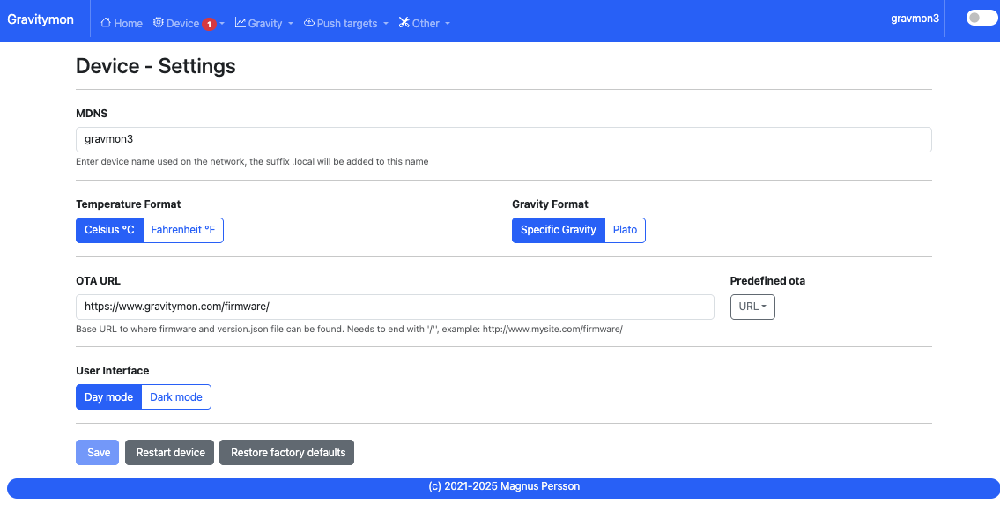

.. _setting-up-device:

Configuration
#############

The device can operate in two modes and must be in ``configuration mode`` in order for the web 
server to be active. The device (esp) LED will flash slowly or show blue color when the device 
is in configuration mode. If the LED is constantly or show white color then the device is in 
WIFI setup mode. The ESP32c3 and ESP32s3 has a LED that can change color.

One of the following conditions will place the device in ``configuration mode``:

- Gyro has not been calibrated
- Sleep mode has been disabled in the web interface
- Placed in horizontal mode 85-90 degrees
- Charger connected >4.15V (or the value that is configured). This does not work on the Floaty variant due to lack of hardware support.

.. tip::

   The easiest way to enter configuration mode is to place the device on a flat surface and press the 
   reset button on the esp a 3 times, each attempt must be within 3 seconds. 
   
   If the LED is solid on show white color then it detected a double reset and has entered WIFI setup mode, in 
   this case just press reset twice again.

From v2 the WIFI setup is built into the UI so everything can now be changed from one User Interface.

Home page 
=========

URL: (http://gravmon.local)

.. image:: images/ui-home.png
  :width: 800
  :alt: Home page

Configuration is accessed by entering the URL for the device, this will be the mDNS name *device.local* or the IP address. The following chapter assumes the device name is *gravmon*.

If the device is not fully configured or there are some hardware issues then these will be visible on the main page. If there are things to adress this will
be indicated in the meny using a red dot.

The main page shows the device readings; gravity, angle, temperature and battery charge. If the checkbox is active then the device will never go into sleep mode. This is useful if 
you are collecting angle/tilt for calibration. If this is unchecked the device will change mode as explained before.

You can also view the average time a gravity measurement takes. Under optimal setting this should be around 1.5 - 2.0 seconds. If this is higher than 2 seconds this is most likely connected to slow wifi 
connection. It will show 0 if data has not been collected yet.

.. tip::

   If you are connected to the device via a serial console (speed: 115200) you can see the connection sequence and get the Unique ID and IP address from there. 

Device 
======

Device - Settings
+++++++++++++++++

* **MDNS:** 

  This is unique name for the device. It will be used in pushing data as well as mDNS name on the network (<name>.local). 
  The limitation is 63 chars but using long names might break endpoints that data is sent to if they have other limitations. 

* **Temperature format:** 

  Choose between Celsius and Fahrenheit when displaying temperature. 

* **Gravity format:**

  Gravity format can be either `SG` or `Plato`. The device will use SG Internally and convert to Plato when displaying or sending data.

* **OTA URL:**

  Should point to a URL where the firmware.bin file + version.json file are located. For an ESP32 target the firmware should be named firmware32.bin.

  For the OTA to work, place the following files (version.json + firmware.bin) at the location that you pointed out in OTA URL. If the version number in the json file is newer than in the 
  code the update will be done during startup.

  If you have the previx `https://` then the device will use secure transfer without CA validation.

  Example; OTA URL (don't forget trailing dash), the name of the file should be firmware.bin

  .. code-block::

    http://192.168.1.1/firmware/gravmon/
    https://192.168.1.1/firmware/gravmon/

* **Dark Mode:**

  Switches the UI between light and dark mode. You can also use the toggle on the menubar for that.

* **Factory default**

  This function will reset all settings to factory default. Use with caution!

* **Restart**

  Restarts the device, similar to pressing the reset button

Device - Hardware
+++++++++++++++++

.. image:: images/ui-device-hardware.png
  :width: 800
  :alt: Device Hardware

* **Voltage factor:**

  Factor used to calculate the battery voltage. If you get a too low/high voltage you can adjust this value.

* **Config voltage:**

  Defines the level of voltage when the device should enter config mode due to charging. This might vary between different battery manufacturers. 
  If you don't what the device to go into configuration mode when charging, set this to 6V. This was added since different batteries have different 
  voltages when fully charged. 

* **Storage sleep**

  When place on the cap (<5 degree tilt) the device will go into deep sleep forever (until reset). In order to wake it 
  up you need to do a reset. One option is to attach a magnetic reed switch (default open) to the reset pin and use a 
  magnet to force a reset without opening the tube. The reed switch is typically an electronic component of 14 mm 
  long encapsulated in a small glass tube. See hardware section for more information, :ref:`hardware`.

* **Battery saving:**

  If this option is checked the sleep interval will be changed to 1 hour when battery drops below 20%. Default = on. This setting is set to off for Floaty builds.

* **DS18B20 Resolution:**

  Define the resolution used on the temp sensor. 9 bits is default and will give an accuracy of 0.5C and and provide longest batterylife. See data below from the datasheet.

  - 9 bits = 0.5°C, up to 93 ms reading
  - 10 bits =0.25°C, up to 187 ms reading
  - 11 bits = 0.125°C, up to 375 ms reading
  - 12 bits = 0.0625°C, up to 850 ms reading

* **Temperature sensor adjustment:**

  This value will be added to the temperature reading (negative value will reduce temperature reading). This is applied
  when the device starts. So changing this will not take affect until the device is restarted.

* **Gyro Temperature:**

  Enable this feature will use the temp sensor i the gyro instead of the DS18B20, the benefit is shorter run time and
  longer battery life (this is an experimental feature). The value used is the first temperature reading from when the 
  device is activated, since the gyro should be cool this is reflecting the surrounding temperature. After it has 
  been running the value would be totally off.  

* **Calibration values:** 

  These are calibration data for the gyro. Place the device flat on a table and press the button to save the default orientation values. Without this calibration we cannot calculate the correct angle/tilt.

  .. warning::

    The device will **not** go into `gravity monitoring` mode unless calibrated

Device - WIFI
+++++++++++++

.. image:: images/ui-device-wifi.png
  :width: 800
  :alt: Device WIFI

* **SSID #1:**

  Select the desired primary SSID to use. 

* **Password #1:**

  Enter the primary password. 

* **SSID #2:**

  Select the desired secondary SSID to use (optional). 

* **Password #2:**

  Enter the secondary password (optional). 

* **Portal timeout:**

  If the wifi portal is triggered (can be triggered by tapping the reset button 2-3 times within 3 seconds) then this is the amount of time allowed before it exists again.

* **Connect timeout:**

  This is the amount of time allowed for a wifi connect. 
   

Gravity
=======

Gravity - Settings
++++++++++++++++++

.. image:: images/ui-gravity-settings.png
  :width: 800
  :alt: Gravity Settings

* **Temperature adjust gravity:**

  Will apply a temperature calibration formula to the gravity as a second step after gravity has been calculated. It's also possible to 
  build this into the gravity formula.

  .. warning::

    This formula assumes that the calibration has been done at 20°C / 68°F.

    Formula used in temperature correction. The calibration temperature can be changed under advanced settings. 

  ::

    gravity*((1.00130346-0.000134722124*temp+0.00000204052596*temp^2-0.00000000232820948*temp^3)/
    (1.00130346-0.000134722124*cal+0.00000204052596*cal^2-0.00000000232820948*cal^3))

* **Gravity calibration temp**

  This option allows you to set the correction temperature used in the automatic temperature gravity adjustment formula. Standard is 20C. 

* **Ignore low angles:**

  If this option is checked any angles below that of SG 1 will be discarded as invalid and never sent to any server. Default = off.

* **Gyro reads:**

  This defines how many gyro reads will be done before an angle is calculated. More reads will give better accuracy and also allow detection of 
  movement. Too many reads will take time and affect battery life. 50 takes about 800 ms to execute.

* **Gyro moving threshold:**

  This is the max amount of deviation allowed for a stable reading. 

Gravity - Formula
+++++++++++++++++

.. image:: images/ui-gravity-formula.png
  :width: 800
  :alt: Gravity Formula

* **Gravity formula:**

  Gravity formula is compatible with standard iSpindle formulas so any existing calculation option can be used. You can also use 
  the feature to create the formula by supplying the raw data. 

  The gravity formula accepts two parameters, **tilt** for the angle or **temp** for temperature (temperature inserted into the formula 
  will be in celsius). I would recommend to use the formula calculation feature instead since this is much easier.

* **Data for gravity calculation:**

  Enter your gravity data SG + Angle. You can enter up to 10 datapoints. Order does not matter and values with zero as angle will be ignored.

* **Max allowed deviation:**

  This is the maximum deviation on the formula allowed for it to be accepted. Once the formula has been derived it will be validated against the supplied 
  data and of the deviation on any point is bigger the formula will be rejected.

* **Calculate new formula:**

  When you submit the values the device will try create a formula with increasing level of complexity. It will start
  with a order 2 formula and then try 3 and 4.

  Once the formula has been created it will validate the formula against the supplied angles/gravity and if there is a too
  high difference, it will fail. You can adjust the max allowed deviation if you have issues. 

  Under the Support / Error Log you will also find hints to what problem the formula creator encountered. Here is an example:

  `CALC: Validation failed on angle 33.430000, deviation too large 5.86, formula order 4`

  `CALC: Validation failed on angle 33.430000, deviation too large 3.14, formula order 2`

  This means that the angle 33.43 had a deviation of 5.8 SG and since the default threshold is 3, it will fail. You 
  can also see that it has failed on that point in both a order 2 and 4 formula.

Gravity - Analysis
++++++++++++++++++

.. image:: images/ui-gravity-analysis.png
  :width: 800
  :alt: Gravity Analysis

Here you can see a graph over the entered values and also how that aligns with the current formula. This can allow you to spot any
values that might be invalid.

Push targets
============

Push - Settings
+++++++++++++++

.. image:: images/ui-push-settings.png
  :width: 800
  :alt: Push Settings

* **Token 1:**

  The token is included in the iSpindle JSON format and will be used for both HTTP targets. If you 
  need to have 2 different tokens you can customize the data format. 

* **Token 2:**

  The token is included in the default format for the HTTP GET url but can be used for any of the formats. 
  For HTTP GET use can use this for an authorization token with ubidots api. 

* **Sleep Interval:** 

  This defines how long the device should be sleeping between the readings when in `gravity monitoring` mode. You will also see 
  the values in minutes/seconds to easier set the interval. 900s is a recommended interval.  The sleep interval can 
  be set between 10 - 3600 seconds (60 minutes). 

  .. note::

    A low value such as 30s will give a lifespan of 1-2 weeks and 300s (5 min) would last for 3+ weeks. This assumes that 
    there is good wifi connection that takes less than 1s to reconnect. Poor wifi connection is the main reason for battery drain. 
    The device will show the estimated lifespan based on the average connection time, if no data exist it will not be shown.

* **WIFI Direct SSID:** 

  This WIFI SSID will be used during gravity mode to send data to the GravityMon Gateway.

* **WIFI Direct Password:** 

  This WIFI Password will be used during gravity mode to send data to the GravityMon Gateway.

* **Enable WIFI Direct:** 

  Enabling this feature will disable all other push target settings and data will be sent to the gateway in a pre-defined format (Currently the iSpindle format).

* **Estimated battery life:** 

  Based on the hardware and the historical execution time the device will estimate how long it can run on a full battery
  with the current interval.

* **Push timeout:** 

  How long the device will wait for a connection accept from the remote service.

Push - HTTP Post
++++++++++++++++

.. image:: images/ui-push-post.png
  :width: 800
  :alt: Push using HTTP Post

* **HTTP URL:**

  Endpoint to send data via http. Default format used is :ref:`data-formats-ispindle`. You can customize the format below.

  If you add the prefix `https://` then the device will use SSL when sending data.

* **HTTP Headers** 

  You can define 2 http headers. Enter a value or just select one from the list.

  The input must have the format **'<header>: <value>'** for it to work. The UI will accept any value so errors 
  will not show until the device tries to push data.

  ::
   
    Content-Type: application/json
    X-Auth-Token: <api-token>

  Mozilla has a good guide on what headers are valid; `HTTP Headers <https://developer.mozilla.org/en-US/docs/Web/HTTP/Headers>`_ 

* **Skip Interval:**

  These options allow the user to have variable push intervals for the different endpoints. 0 means that every wakeup will send data 
  to that endpoint. If you enter another number then that defines how many sleep cycles will be skipped for this target.

* **Data format:**

  Here you can customize the data format used when sending data to the server. You can either enter your own formula or choose one
  from the list. For more information on this topic, see :ref:`format-template`. 
  
  .. note::

    If you right click in this field a list of available variables will be shown.

Push - HTTP Get
+++++++++++++++

.. image:: images/ui-push-get.png
  :width: 800
  :alt: Push using HTTP Get

* **HTTP URL:**

  Endpoint to send data via http. You can customize the format below.

  If you add the prefix `https://` then the device will use SSL when sending data.

* **HTTP Headers** 

  You can define 2 http headers. Enter a value or just select one from the list.

  The input must have the format **'<header>: <value>'** for it to work. The UI will accept any value so errors 
  will not show until the device tries to push data.

  ::
   
    Content-Type: application/json
    X-Auth-Token: <api-token>

  Mozilla has a good guide on what headers are valid; `HTTP Headers <https://developer.mozilla.org/en-US/docs/Web/HTTP/Headers>`_ 

* **Skip Interval:**

  These options allow the user to have variable push intervals for the different endpoints. 0 means that every wakeup will send data 
  to that endpoint. If you enter another number then that defines how many sleep cycles will be skipped for this target.

* **Data format:**

  Here you can customize the data format used when sending data to the server. You can either enter your own formula or choose one
  from the list. For more information on this topic, see :ref:`format-template`. 
  
  .. note::

    If you right click in this field a list of available variables will be shown.

Push - InfluxDB v2
++++++++++++++++++

.. image:: images/ui-push-influx.png
  :width: 800
  :alt: Push using InfluxDB v2

* **Server:**

  Endpoint to send data via http to InfluxDB. Format used :ref:`data-formats-influxdb2`. You can customize the format using :ref:`format-template`.

  SSL is not supported for this target. Raise a issue on github if this is wanted.

* **Organisation:**

  Name of organisation in Influx.

* **Bucket:**

  Token for bucket. Don't use the bucket name.

* **Authentication Token:**

  Token with write access to bucket.

* **Skip Interval:**

  These options allow the user to have variable push intervals for the different endpoints. 0 means that every wakeup will send data 
  to that endpoint. If you enter another number then that defines how many sleep cycles will be skipped for this target.

* **Data format:**

  Here you can customize the data format used when sending data to the server. You can either enter your own formula or choose one
  from the list. For more information on this topic, see :ref:`format-template`. 
  
  .. note::

    If you right click in this field a list of available variables will be shown.

Push - MQTT
+++++++++++

.. image:: images/ui-push-mqtt.png
  :width: 800
  :alt: Push using MQTT

* **Server:**

  IP or name of server to send data to. Default format used :ref:`data-formats-mqtt`. You can customize the format using :ref:`format-template`.

* **Port:**

  Which port should be used for communication, default is 1883 (standard port). For SSL use 8883 (any port over 8000 is treated as SSL). 

* **User name:**

  Username or blank if anonymous is accepted

* **Password:**

  Password or blank if anonymous is accepted

* **Skip Interval:**

  These options allow the user to have variable push intervals for the different endpoints. 0 means that every wakeup will send data 
  to that endpoint. If you enter another number then that defines how many sleep cycles will be skipped for this target.

* **Data format:**

  Here you can customize the data format used when sending data to the server. You can either enter your own formula or choose one
  from the list. For more information on this topic, see :ref:`format-template`. 
  
  .. note::

    If you right click in this field a list of available variables will be shown.

Push - Bluetooth
++++++++++++++++

.. image:: images/ui-push-ble.png
  :width: 800
  :alt: Push using Bluetooth

* **TILT color: (Only ESP32)**

  Select the TILT color that will be used to transmit data. Only valid if TILT format is chosen above.

* **Bluetooth data format: (Only ESP32)**

  Choose the bluetooth transmission to use.

  - **TILT iBeacon**: Standard tilt data transmission. Data: Gravity and Temperature   
  - **TILT PRO iBeacon**: Higher accuracy tilt data transmission. Data: Gravity and Temperature   
  - **GM iBeacon**: Higher accuracy. Data: Gravity, Temperature, ID, Angle
  - **GM SERVICE**: Client can read standard iSpindle JSON payload, require connection with device.
  - **GM EDDYSTONE**: Beacon format that requires active scanning by the client. Data: Gravity, ID, Temperature and Angle 

Other
=====

Other - Serial
++++++++++++++

.. image:: images/ui-other-serial.png
  :width: 800
  :alt: Serial console

Connects to the device and shows the serial output, useful for debugging.

Other - Backup
++++++++++++++

.. image:: images/ui-other-backup.png
  :width: 800
  :alt: Backup & Restore

Here you can download a file with all of the device settings and also restore data if needed. Each file is unique for a device which is determined by the field "id". 
Modifying this field will allow you to create a template that can be used on any device. This field is stored in more than one place of the file and all needs to be 
changed for this to work.

When downloading a backup the file will be named **gravitymon<deviceid>.txt**

.. note::

  The gravity formula will be recreated if calibration points are available on the device, so the formula might be different than what is in the file.

Other - Firmware
++++++++++++++++

.. image:: images/ui-other-firmware.png
  :width: 800
  :alt: Firmware update

* **Upload Firmware**

  This option gives you the possibility to install an new version of the firmware (or any firmware that uses the standard flash layout).

Other - Support
+++++++++++++++

.. image:: images/ui-other-logs.png
  :width: 800
  :alt: Support

* **View device logs**

  Shows the log entires stored on the device, can also be used to delete the current logs.

Other - Tools
+++++++++++++

.. image:: images/ui-other-tools.png
  :width: 800
  :alt: Tools

* **Calculate voltage factor**

  Can be used to calculate a new voltage factor based on measured voltage and current readings.

* **List files**

  Shows the files on the device and allows a user to show the contents of those files.

Other - About
+++++++++++++

.. image:: images/ui-other-about.png
  :width: 800
  :alt: About

Shows information about the software
