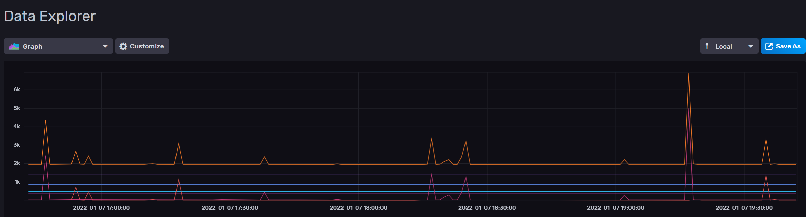

.. _functionallity:

Functionallity
==============

The main features
-----------------

* **Operates in two modes gravity monitoring and configuration mode**

  In ``gravity monitoring`` mode it behaves just like the iSpindle, it wakes up at regular intervals, measures angle/tile, temperature, calculates gravity and pushes the data to defined endpoints. 

  In ``configuration mode`` the device is always active and the webserver is active. Here you can view the angle/tilt values, change configuration options and more. When in this mode you can also interact with the device
  via an REST API so data can be pushed to the device via scripts (see API section for more information).

  You can force the device into ``configuration mode`` while measuring gravity. This is useful when calibrating the device so you don't needs to wait for the device to wake up and push the data. The entire calibration
  sequence can be handled via the web interface without need for additional software tools.

  See the :ref:`setting-up-device` section for more information on how to trigger the configuration mode.

* **Can send data to multiple endpoints at once**

  The original iSpindle can only have one destination, this software will push data to all defined endpoints so in theory you can use them all. However this will consume a lot of battery power so use only as many as needed. 

  Currently the device supports the following endpoints: http (2 different), influxdb2 and Brewfather

  If you want additional targets please raise a feature request in the github repo.

* **Create gravity formulas on the device**

  Another big difference is that this software can create the gravity formula in the device, just enter the angle/gravity data that you have collected. You will also see a graph simulating how the formula would work. 

.. note::

  This feature needs more testing to be validated.

* **Customize the data format beeing sent to push targets**

  In order to make it easier to support more targets there is a built in format editor that can be used to customize the data that is to be sent. This way you can easily adapt the software to new targets without coding. If you have 
  a good template please share it on the girhub repository and I will add it to the documentation for other users to enjoy. See the :ref:`format-editor` for more information.

.. note::

  This feature needs more testing to be validated.

* **Automatic temperature adjustment of gravity reading**

  If you want to correct gravity based on beer temperature you can do this in the formula but here is a nice feature that can correct the gravity as a second step making this independant of the formula. 

.. note::

  This feature needs more testing to be validated.

* **OTA support from local webserver**

  When starting up in configuration mode the device will check for a software update from a local webserver. 

* **DS18B20 temperature adjustments**

  You can adjust the temperature reading of the temperature sensor.

* **Gyro Movement**

  The software will detect if the gyro is moving and if this is the case it will go back to sleep for 60seconds. 
  This way we should avoid faulty measurements.

* **WIFI connection issues**

  The software will not wait indefiently for a wifi connection. If it takes longer than 20 seconds to connect then
  the device will go into deep sleep for 60 seoncds and then retry.

* **Use gyro temperature sensor**

  This works fine when the device has time to cool down between measurements and it saves up to 400 ms. 
  My testing shows that this is quite accurate with a deviation of less than 0.3C. This  
  reduces the run time by 20% (with optimal wifi connection). 
  
  The graph below compares from the temp from two different devices in the same bucket of water. One with 
  gyro temp enabled and one with the DS18B20 sensor. The blue line is the gyro temperature and this clear
  that the temperature will be higher after it has been running but cools down when in sleep mode. The interval 
  has been set to 300s. A low delay of 30s will not allow the gyro to cool down and the temperature will 
  be 0.5-1.0C higher.

.. image:: images/temp1.png
  :width: 800
  :alt: Gyro temp vs DS18B20

Other features
--------------

* Support for Celcius and Farenheigt as temperature formats.

* Support SG (Plato is not yet supported)

* Gyro data is read 50 times to ensure good accuracy

Experimental features
---------------------

* **Performance measurements** 

  I've also create a small library to measure execution code in some areas of the code that i know is time consuming. This way I can find a good balance between performace and quality.

  See the :ref:`compiling-the-software` for more information.

* **Power measurements** 

  I've also create a project to measure the power consumption of the device, but more on this later.

Battery life
------------

I'm currently measuring battery life of v0.5 but previous versions have been able to measure gravity for a 2-3 weeks without issues (Using 900 seconds as interval). 

*More on this topics once my tests are done*

Performance 
-----------

Since I have the possibility to measure the performance of different function in the code this is what I have been able to gather.

The typical runtime in a measurement cycle is approx 2 seconds and in some cases it can take up to 6-8 seconds but this is mainly related to establishing the WIFI connection. So stable wifi is 
essential for long batterylife. Out of the 2 seconds of run-time the major time is spent on gyro readings (1.3s) and temperature measurements of (0.6s) so using the gyro sensor for measureing 
temperature would reduce the total runtime with 25%. Sending data over http takes less than 100ms (on my local network) so this is not drawing much power. 

The image below shows how the run-time varies over time. The pink line is the wifi connection time and this is why the time varies. The orange is the total runtime for the awake period.

