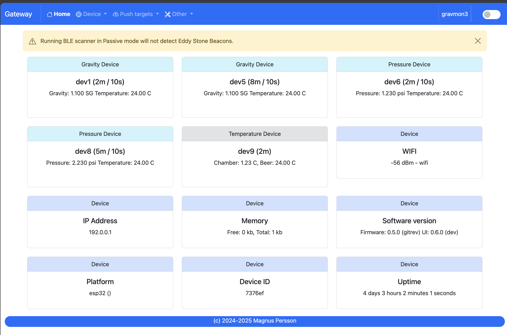
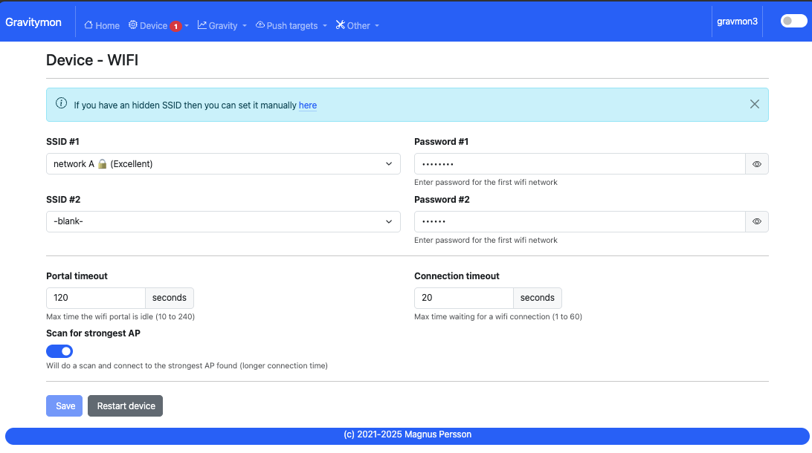

.. _gateway:

Gateway
#######

.. note::

  This documentation reflects **v0.4.0 beta 1**. Last updated 2024-08-02

GravityMon gateway is an addon device that can recieve the new BLE broadcast options as well as handle the Wifi Direct feature introduced in v2.0.

The main supported hardware is ESP32s3 PRO with a TFT 

* `Lolin ESP32s3 PRO <https://www.wemos.cc/en/latest/s3/s3_pro.html>`_ 
* `Lolin TFT <https://www.wemos.cc/en/latest/d1_mini_shield/tft_2_4.html>`_ 
* Cable to connect the display with the ESP

There is also a build for the ESP32 PRO (Tiltbridge Hardware setup) but that does not support the new BLE formats since that board does not have BLE 5 support.

* `Releases for GravityMon Gateway <https://github.com/mp-se/gravitymon-gateway/releases>`_ 

Most of the UI is copied from GravityMon with a few alterations so the documentation here will only point out the differences.

.. note::

  GravityMon gateway does not support the TILT options, if you want to use these I recommend Tiltbridge that has a lot of good features for that.

Home page 
=========

URL: (http://gravmon-gw.local)

The main page shows the device settings as well as the latest readings from connected devices. 

Device 
======

Device - Settings
+++++++++++++++++

.. image:: images/gw/ui-device-settings.png
  :width: 800
  :alt: Device Settings

* **MDNS:** 

  This is unique name for the device. It will be used in pushing data as well as mDNS name on the network (<name>.local). 
  The limitation is 63 chars but using long names might break endpoints that data is sent to if they have other limitations. 

* **Temperature format:** 

  Choose between Celsius and Fahrenheit when displaying temperature. 

* **Gravity format:**

  Gravity format can be either `SG` or `Plato`. The device will use SG Internally and convert to Plato when displaying or sending data.

* **Dark Mode:**

  Switches the UI between light and dark mode. You can also use the toggle on the menubar for that.

* **Factory default**

  This function will reset all settings to factory default. Use with caution!

* **Restart**

  Restarts the device, similar to pressing the reset button

Device - Hardware
+++++++++++++++++

.. image:: images/gw/ui-device-hardware.png
  :width: 800
  :alt: Device Hardware

* **Scan mode:**

  Determine if the BLE scan will be done in active or passive mode. 

* **Scan time:**

  Time the BLE scan cycle. Don't use too long time since this will impact the updates on readings and display.

* **Time zone:**

  Select the timezone so that date / time will be correcly displayed. This is not an extensive list of all timezones so let me know if you are missing one. 

Device - WIFI
+++++++++++++

Most of these settings are the same as for GravityMon with the following expections.

* **Direct SSID:**

  Name of the SSID that GravityMon devices will use in Wifi Direct mode.

* **Direct Password:**

  Enter the SSID password. 

* **Generate:**

  Will create an SSID and Password

Push targets
============

Push - Settings
+++++++++++++++

.. image:: images/gw/ui-push-settings.png
  :width: 800
  :alt: Push Settings

* **Token:**

  If the incoming payload does not contain the token this value will be added to the outgoing payload.

* **Push timeout:** 

  How long the device will wait for a connection accept from the remote service.

* **Push minium resend time:** 

  This the minimum time before an update can be sent. Some remote services do not want to have updates too often. 

Push - HTTP Post
++++++++++++++++

See GravityMon configuration.

Push - HTTP Get
+++++++++++++++

See GravityMon configuration.

Push - InfluxDB v2
++++++++++++++++++

See GravityMon configuration.

Push - MQTT
+++++++++++

See GravityMon configuration.

Push - Bluetooth
++++++++++++++++

.. image:: images/ui-push-ble.png
  :width: 800
  :alt: Push using Bluetooth

* **TILT color: (Only ESP32)**

  Select the TILT color that will be used to transmit data. Only valid if TILT format is chosen above.

* **Bluetooth data format: (Only ESP32)**

  Choose the bluetooth transmission to use.

  - **TILT iBeacon**: Standard tilt data transmission. Data: Gravity and Temperature   
  - **TILT PRO iBeacon**: Higher accuracy tilt data transmission. Data: Gravity and Temperature   
  - **GM iBeacon**: Higher accuracy. Data: Gravity, Temperature, ID, Angle
  - **GM SERVICE**: Client can read standard iSpindle JSON payload, require connection with device.
  - **GM EDDYSTONE**: Beacon format that requires active scanning by the client. Data: Gravity, ID, Temperature and Angle 

Other
=====

Other - Serial
++++++++++++++

See GravityMon configuration.

Other - Backup
++++++++++++++

See GravityMon configuration.

Other - Firmware
++++++++++++++++

See GravityMon configuration.

Other - Support
+++++++++++++++

See GravityMon configuration.

Other - Tools
+++++++++++++

See GravityMon configuration.

Other - About
+++++++++++++

Shows information about the software
