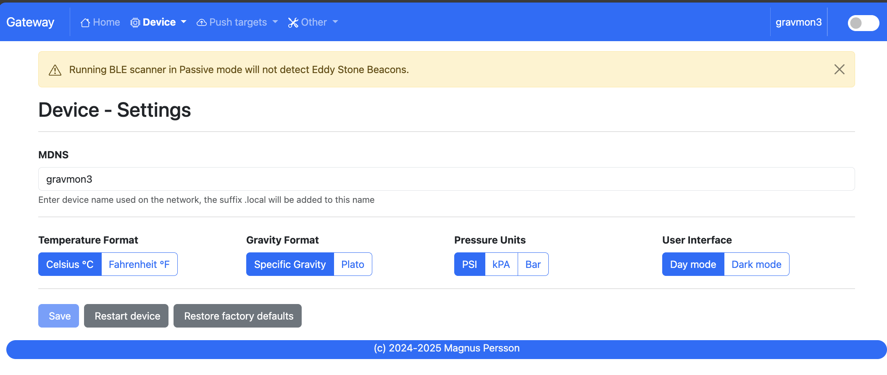

.. _gateway:

Gateway
#######

.. note::

  This documentation reflects **v0.9.0**. Last updated 2025-12-28

GravityMon Gateway is an separate project that can act as a proxy between your Gravitymon/Pressuremon devices and services. It can:

* Receive Gravitymon 2.0+ BLE formats
* Receive Pressuremon 0.4+ BLE formats
* Receive Chamber Controller 0.4+ BLE formats
* Receive Gravitymon data via direct WiFi connection (http post). 
* Receive Pressuremon data via direct WiFi connection (http post). 

For complete release notes see the github project page.

Hardware 
========

The main supported hardware is an Waveshare ESP32s3 PRO with a built in TFT 

* `Waveshare ESP32s3 TFT <https://www.waveshare.com/product/mcu-tools/development-boards/esp32/esp32-s3-touch-lcd-2.8.htm)>`_ 

The second options is Lolin ESP32s3 PRO with a Lolin TFT 

* `Lolin ESP32s3 PRO <https://www.wemos.cc/en/latest/s3/s3_pro.html>`_ 
* `Lolin TFT <https://www.wemos.cc/en/latest/d1_mini_shield/tft_2_4.html>`_ 
* Cable to connect the display with the ESP

There is also a build for the ESP32 PRO (Tiltbridge Hardware setup) but that does not support the new BLE formats since that board 
does not have BLE 5 support or the SD card support.

* `Releases for GravityMon Gateway <https://github.com/mp-se/gravitymon-gateway/releases>`_ 

3d printable cases for the build

* `Thorraks Tiltbridge case for D32 PRO <https://www.printables.com/model/141680-tiltbridge-case-d32-pro-w-tft>`_ 
* `Modified Tiltbridge case for D32 s3 PRO <https://www.printables.com/model/939801-case-for-esp32-s3-pro-w-tft>`_ 

Most of the UI is copied from Gravitymon with a few alterations so the documentation here will only point out the differences. 
In the recent releases some of the codebase is shared across both projects.

.. note::

  Gravitymon Gateway does not support the BLE TILT / BLE RAPT options, it will detect and display but not forward these to the targets.

  If you want to use these I recommend Tiltbridge that has a lot of good features for that. The main reason is that these formats
  have very little data and would require a lot of work to make the gateway add the missing information. Tiltbridge already has this
  support built in so it makes little sense to replicate that work.

Home page 
=========

URL: (http://gravmon-gw.local)

.. image:: images/gw/ui-home.png
  :width: 800
  :alt: Home page

The main page shows the device settings as well as the latest readings from connected devices. 

Device 
======

Device - Settings
+++++++++++++++++

* **MDNS:** 

  This is unique name for the device. It will be used in pushing data as well as mDNS name on the network (<name>.local). 
  The limitation is 63 chars but using long names might break endpoints that data is sent to if they have other limitations. 

* **Temperature format:** 

  Choose between Celsius and Fahrenheit when displaying temperature. 

* **Gravity format:**

  Gravity format can be either `SG` or `Plato`. The device will use SG Internally and convert to Plato when displaying or sending data.

* **Pressure format:**

  Pressure format can be either `PSI`, `kPa` or `Bar`. The device will use PSI Internally and convert to other formats when displaying or sending data.

* **Dark Mode:**

  Switches the UI between light and dark mode. You can also use the toggle on the menubar for that.

* **Factory default**

  This function will reset all settings to factory default. Use with caution!

* **Restart**

  Restarts the device, similar to pressing the reset button

Device - Hardware
+++++++++++++++++

.. image:: images/gw/ui-device-hardware.png
  :width: 800
  :alt: Device Hardware

* **Enable Bluetooth:**

  Enable to disable BLE scanning. 

* **Scan mode:**

  Determine if the BLE scan will be done in active or passive mode. 

* **Scan time:**

  Time the BLE scan cycle. Don't use too long time since this will impact the updates on readings and display.

* **Time zone:**

  Select the timezone so that date / time will be correcly displayed. This is not an extensive list of all timezones so let me know if you are missing one. 

Device - WIFI
+++++++++++++

.. image:: images/gw/ui-device-wifi.png
  :width: 800
  :alt: Device WIFI

Most of these settings are the same as for GravityMon with the following expections.

* **Direct SSID:**

  Name of the SSID that GravityMon devices will use in Wifi Direct mode.

* **Direct Password:**

  Enter the SSID password. 

* **Generate:**

  Will create an SSID and Password

Measurements
============

Measurements - Settings
+++++++++++++++++++++++

.. image:: images/gw/ui-measurements-settings.png
  :width: 800
  :alt: Measurements Settings

* **Number of SD log files**

  How many log files should be kept on the SD card, each file is max 16kb in size. Default it 4.

Measurements - View
+++++++++++++++++++

.. image:: images/gw/ui-measurements-view.png
  :width: 800
  :alt: Measurements View

Once the data is loaded a list of the device types loggged with be shown, one you select a type you can see all the
data points stored and also a list of devices. If you then select a device a graph with the key data will be shown.

Push targets
============

Push - Settings
+++++++++++++++

.. image:: images/gw/ui-push-settings.png
  :width: 800
  :alt: Push Settings

* **Token:**

  If the incoming payload does not contain the token this value will be added to the outgoing payload.

* **Push timeout:** 

  How long the device will wait for a connection accept from the remote service.

* **Push minium resend time:** 

  This the minimum time before an update can be sent. Some remote services do not want to have updates too often. 

Push - HTTP Post
++++++++++++++++

.. image:: images/gw/ui-push-post.png
  :width: 800
  :alt: HTTP Post

Most of the settings are the same for Gravitymon but with the extension to handle both pressure and gravity data for the same endpoint. Based on what
data is received the gateway will choose the correct template for that data. You can also disable gravity/pressure data for each endpoint.

Push - HTTP Get
+++++++++++++++

See GravityMon configuration.

Push - InfluxDB v2
++++++++++++++++++

See GravityMon configuration.

Push - MQTT
+++++++++++

See GravityMon configuration.

Other
=====

Other - Serial
++++++++++++++

See GravityMon configuration.

Other - Backup
++++++++++++++

See GravityMon configuration.

Other - Firmware
++++++++++++++++

See GravityMon configuration.

Other - Support
+++++++++++++++

See GravityMon configuration.

Other - Tools
+++++++++++++

See GravityMon configuration.

Other - About
+++++++++++++

Shows information about the software
