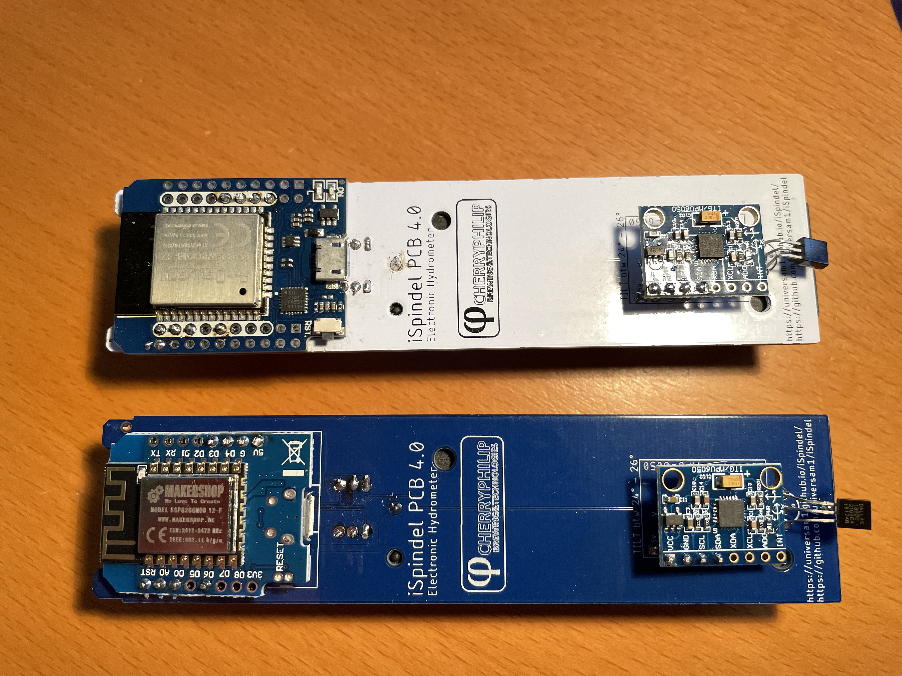
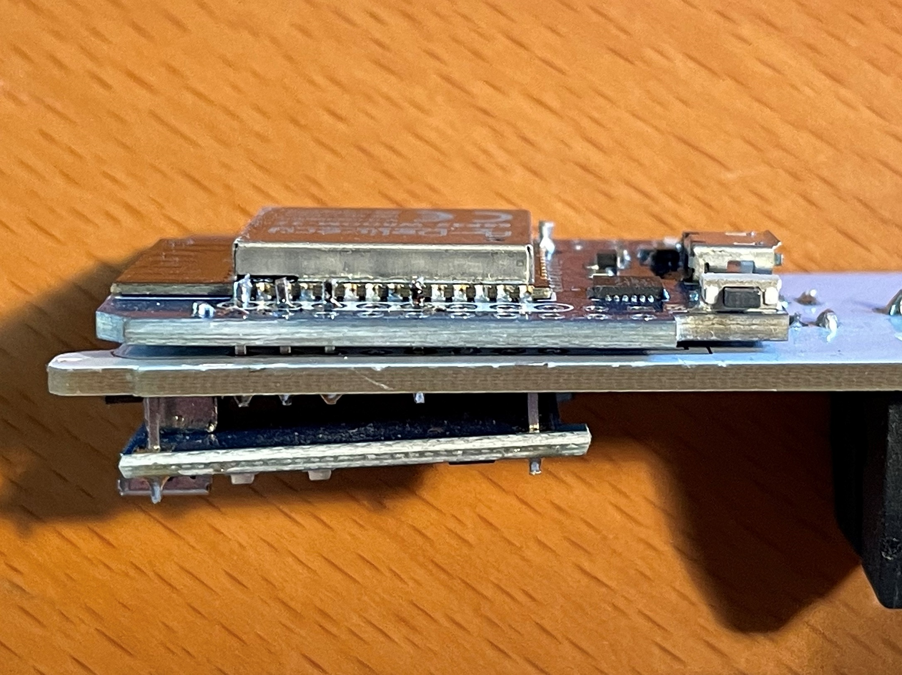

.. _hardware:

Hardware
########

There are lots of resouces out there on how to build the hardware for an iSpindle so I will not go into details on that part. Here are two of my builds using the iSpindle PCB v4.

It's possible to use this PCB and mount an ESP32 on top of that. It must be an pin compatible ESP32 and the one I used was called *ESP32 d1 mini*. Since this is the same width as the PCB you need to 
mount it really close to the PCB in order for it to fit in the PET tube/container. I also had to smooth the edge of the ESP32 in order for it to fit. 

I would suggest that you try how it fits into the PET tube before soldering it to the PCB. Make sure that the battery is attached since this will be a really tight fit.

You also need to desolder (remove) the RED ON LED from the ESP32 or the battery power will be reduced a lot.

Final thing is to add a resistor between A0 (Analog PIN) and ground of 470k. The reason is that the esp8266 has a build in resistor which 
the esp32 does not have. So in order to get a valid voltage (less than 3.2V) on the A0 pin this is needed. Once the modification is done you might
need to adjust the voltage factor so the battery reading is correct. 

Schema for esp8266 build
------------------------

.. image:: images/schema_esp8266.png
  :width: 700
  :alt: Schema esp8266

Schema for esp32 build
----------------------

.. note::  
  This schema assumes that an ESP32 D1 Mini (pin compatible with ESP8266 D1 Mini is used)
  The ESP32 has two rows of pins but only the inner row is used. The main difference is the added resistor R3 so we 
  get a voltage divider for measuring battery. The ESP8266 has a built in resistor thats not visible on the schema. 

.. image:: images/schema_esp32.png
  :width: 700
  :alt: Schema esp32

Modifying with reed switch
--------------------------

A reed switch is a switch that reacts to magnetic fields. The ones I have tested are normally open and close in proximity to 
a magnet. 

.. image:: images/reed.jpg
  :width: 400
  :alt: Reed switch

If this is connected to the reset button a magnet can be used to trigger a reset of the device. The image below shows how 
I mounted the iSPINDLE PCB v4.0 just under the cap. The lower red circle shows the reset connection point for the reed switch.

.. image:: images/reed_build.jpg
  :width: 400
  :alt: Reed build

