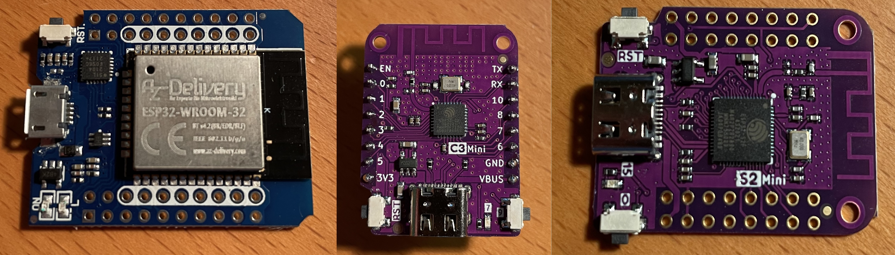
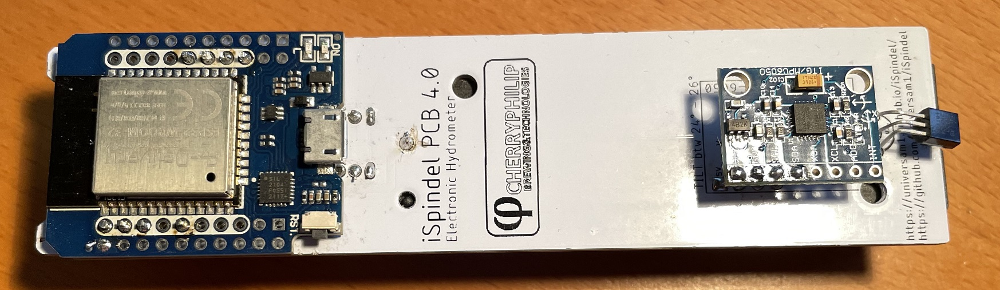
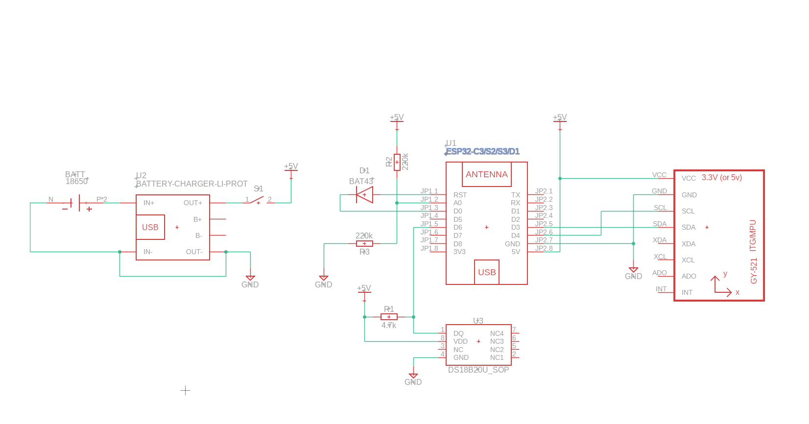

.. _hardware:

Hardware
########

I'm not a hardware designer so I would recommend the following resources for more in depth information on this topic.

* `Cherry Philip Hardware design <https://github.com/cherryphilip74/iSpindel-PCB>`_
* `OpenSource Distilling <https://www.opensourcedistilling.com/ispindel>`_

Custom boards
=============

Besides the standard boards listed here (which are tested and verified by me) there is also a possibility 
to add custom boards which are included in the builds and made available through this gihub repository. 
A list of these boards can be found here :ref:`custom-boards`. I cannot take full responsibility for these 
builds since I dont have access to these boards for testing.

iSpindle based on esp8266
=========================

There are lots of resouces out there on how to build the hardware for an iSpindle so I will not go into details on that part. I typically use one of the 
excellent pcb boards that, for example the iSpindel PCB v4.0 from Cherry Philip. Here is one of my standard builds using an esp8266.

.. image:: images/ispindel_esp8266.jpg
  :width: 500
  :alt: iSpindle esp8266

Schema for esp8266 build
++++++++++++++++++++++++

.. image:: images/schema_esp8266.png
  :width: 700
  :alt: Schema esp8266

iSpindle based on esp32
=======================

Gravitymon supports a number of ESP32 boards that offers bluetooth support. 

* esp32d1 mini, this was the first board i tried which is a smaller form factor of the first generetion esp32 with 2 cores. Slow on connecting to wifi is the main downside. 
* esp32c3 mini, a newer version based on the latest risc v7 architecture, is seen as the replacement for the esp8266 with bluetooth support. Don't buy v1.0 since that has a faulty wifi antenna.
* esp32s2 mini, similar to the c3 board but without bluetooth support. 
* esp32s3 mini, similar to the s2 board but with bluetooth support. 

It's possible to use this PCB and mount an ESP32 mini on top of that (c3 or s2 are prefered). The esp32 d1 mini is a larger formfactor and can be hard to fit into the tube.

.. note::
  You need to add a resistor between A0 (Analog PIN) and ground of 220k. The reason is that the esp8266 has a build in resistor for a voltage divider 
  which the esp32 does not have. So in order to get a valid voltage (less than 2.3V on the analog pin. This depends on the board) on the analog pin this is needed. Once the modification is done you might
  need to adjust the voltage factor so the battery reading is correct. 

ESP32c3 mini
++++++++++++

This is model is fully supported by gravitymon. 

.. image:: images/ispindel_esp32c3.jpg
  :width: 500
  :alt: Esp32c3 mini build

Here is an image of where I added the resistor for the voltage divider. 

.. image:: images/esp32_res.jpg
  :width: 500
  :alt: Esp32c3 adding resistor as voltage dividier.

ESP32s2 mini
++++++++++++

This is model is fully supported by gravitymon. Same setup as for ESP32C3 mini.

ESP32s3 mini
++++++++++++

This is model is fully supported by gravitymon. Same setup as for ESP32S2 mini.

ESP32 d1 mini
+++++++++++++

I would suggest that you try how it fits into the PET tube before soldering it to the PCB. Make sure that the battery is attached since this will be a really tight fit.

Schema for esp32 build
++++++++++++++++++++++

.. note::  
  This schema assumes that an ESP32 d1 mini (pin compatible with ESP8266). The ESP32 has two rows of pins but 
  only the inner row is used. The main difference is the added resistor R3 so we get a voltage divider for measuring battery. 
  The ESP8266 has a built in resistor thats not visible on the schema and this acts as a voltage divider. 

Adding a reed (magnetic) reset switch
+++++++++++++++++++++++++++++++++++++

A reed switch is a switch that reacts to magnetic fields. The ones I have tested are normally open and close in proximity to 
a magnet. 

.. image:: images/reed.jpg
  :width: 400
  :alt: Reed switch

If this is connected to the reset button a magnet can be used to trigger a reset of the device. The image below shows how 
I mounted the iSPINDLE PCB v4.0 just under the cap. The lower red circle shows the reset connection point for the reed switch.

The reed switch is the glass tube visible under the esp8266.

.. image:: images/reed_build.jpg
  :width: 400
  :alt: Reed build

Hardware extensions
===================

GravityMon has implemented a few additions to the standard iSpindel hardware. It's possible to channel the serial console to the TX/RX pins on the chip (these position also applies to all the 
ESP32 chips for iSpindel). You need a USB to TTL converter for this to work. This enables you to read the serial console even when on battery (newer chips dont have a diode to remove).

.. note::
  You need to compile the software using the -DUSE_SERIAL_PINS option to enable this feature. 

Its also possible to force the device into configuration mode by connecting D7/D8 on the board during the startup sequence. This will enable the feature "gravity mode enabled during float".

.. image:: images/8266_pins.jpg
  :width: 500
  :alt: iSpindel pins

New Gyro options
================

Besides the standard MPU-6050 and MPU-6500 gravitymon now also supports the ICM-42670-p which can be obtained from Aliexpress as a development board. 
There is some work ongoing to create a new PCB based on this gyro. I will update with links when available.

.. image:: images/gyro-icm42670p.png
  :width: 200
  :alt: ICM-42670-P

This is what I have used during my testing but it has a different orientation compared to the MPU-6050 but there is a setting in the device configuration
that allows you to use the Y axis for tilt detection. The boards I used is pin compatible with the order board so current iSpindle PCB can be used.
  
.. note::
  The ICM gyro does not have any calibration feature since they are calibrated from the factory. So mounting the at the correct angle is important.
