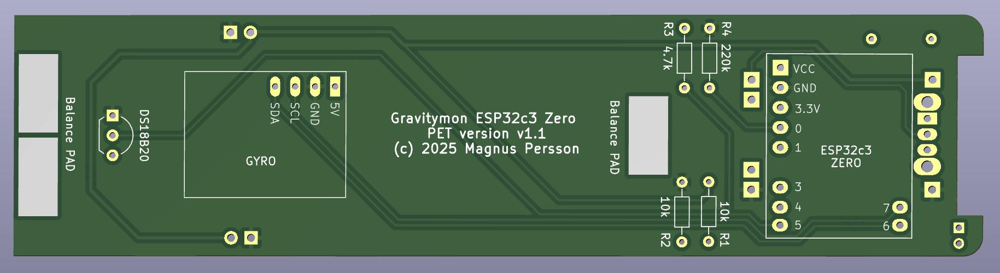
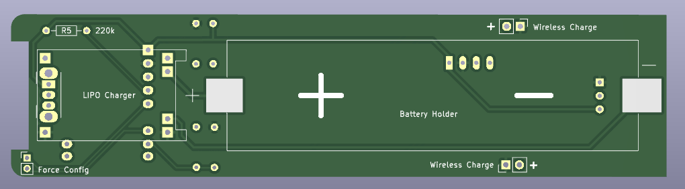

.. _hardware:

Hardware
########

Here are some option that can be used to build a gravitymon device

* `Cherry Philip Hardware design <https://github.com/cherryphilip74/iSpindel-PCB>`_
* `OpenSource Distilling <https://www.opensourcedistilling.com/ispindel>`_
* `iSpindel Gravitymon Pill PCB <https://github.com/andreq/iSpindel-Gravitymon-Pill-PCB>`_
* `iSpindel <https://github.com/hobipivo/iSpindel>`_

I have now also created my own PCB design for Gravitymon which enable all the features not available in 
most other projects. I'm working on more options but this is a slow process since delivery of prototypes 
take time. 

My PCB's are designed in Kicad and stored in my repository `mp-se/pcb_designs <https://github.com/mp-se/pcb-designs/>`_

You can also order the `PCB from PCBWAY here <https://www.pcbway.com/project/shareproject/Gravitymon_PCB_for_ESP32c3_Zero_PET_3a69bb89.html>`_

Currently i'm also working on a PCB for the PILL casing with the Waveshare ESP32c3 Zero board.

Supported ESP boards
********************

From v2.3 i have changed the main boards that I support as part of this project and the focus is now
moving towards ESP32 based boards. The main reason is that the ESP8266 is old and resources are limited
for adding new features. The original iSpindle design is starting to get older and new and better boards 
and components exist today.

For the pcbs make for the ESP8266 some of the features will not be available but I'm currently working with 
some pcb designeers to create new options that full utilize the features in Gravitymon.

I'm working on adding more ESP options and I will add the pinouts once they have been confirmed.

.. list-table:: GPIO pins for ESP boards
   :header-rows: 1

   * - Board
     - SDA
     - SCL
     - OneWire
     - Battery
     - Reset
     - Charging
     - Config
   * - Lolin ESP8266
     - D3
     - D4
     - D6
     - A0
     - EN
     - n/a
     - D8 / D7
   * - Lolin ESP32 c3 mini
     - 7
     - 6
     - A0
     - A3
     - EN
     - A1
     - A5 / A4
   * - Lolin ESP32 s2 mini
     - A17
     - A15
     - A8
     - A2
     - EN
     - A6
     - A10 / A11     
   * - Lolin ESP32 s3 mini
     - A17
     - A15
     - A12
     - A1
     - EN
     - A11
     - A9 / A10
   * - Waveshare ESP32c3 Zero
     - IO6
     - IO7
     - IO5
     - A0
     - n/a
     - A4
     - A1 / A3
   * - Tenstar ESP32c3 super mini
     - IO7
     - IO6
     - A0
     - A3
     - n/a
     - A4
     - IO10 / A1

Custom boards
+++++++++++++

Besides the standard boards listed here (which are tested and verified by me) there is also a possibility 
to add custom boards which are included in the builds and made available through this gihub repository. 
A list of these boards can be found here :ref:`custom-boards`. I cannot take full responsibility for these 
builds since I dont have access to these boards for testing.

Gravitymon PCB
**************

Waveshare ESP32c3 Zero using PET casing
+++++++++++++++++++++++++++++++++++++++

This is my own design of a PCB for Gravitymon using the same PET casing as for the iSpindel. For building this you need:

* XL BIG PET Micro Geocaching container
* Gravitymon PCB (Order from PCBWAY)
* Waveshare ESP32c3 Zero board (18-pin board)
* MPU-6050 (GY-521) or ICM-42670-P gyro board
* 18650 battery holder for surface mount (smt)
* 18650 battery
* Wireless Charging reciver and transmitter (XKT510-24)
* Resistor: 2 x 10k 0.25W (R1+R2)
* Resistor: 2 x 220k 0.25W (R4+R5)
* Resistor: 1 x 4.7k 0.25W (R3)
* Charging module TP4056
* Switch (SK12D07VG3)
* Dallas DS18B20 temperature sensor

This is the schematic that is used for this design enabling all the features in Gravitymon.

.. image:: images/gravitymon_schema.png
  :width: 600
  :alt: Gravitymon Schema

This is the back / front of the PCB design.

  

Build instructions
++++++++++++++++++

I would also recommend to flash the ESP before soldering it so you know it works and connects to your wifi correctly.

* Start with soldering the switch which goes under the charger module.
* Solder the connectors for the ESP but dont mount the board just yet.
* Solder the connectors for the GYRO, make sure the pins for the GYRO should not go all the way through, they need to be flush with the PCB since the battery holder goes on top. Then you can mount the gyro, place something under the gyro so its flat with the PCB so its leveled.
* Mount the resistors and solder them in place. 
* Mount the temperature sensor and also ensure the pins are flush with the PCB.
* Mount the connectors for the charger module and solder that in place on top of the switch.
* Solder the batter holder in place, start with putting solder on the pads and on the copper connectors, that way its easier to solder them in place.
* Now solder the ESP in place
* Finally you can solder the wireless charger module (this is optional) on either side, choose the one that fits your build.

Once the device is mounted you can test it in water. It should be close to 25 degrees (+/- 2 degrees is acceptable), if not you can use 
the balance pads to add some solder/weight to change the angle. If the angle is too high then use the bottom pads. I have noticed that the batteries
can differ in weight, they should be around 44g.

iSpindle based on esp8266
*************************

There are lots of resouces out there on how to build the hardware for an iSpindle so I will not go into details on that part. I typically use one of the 
excellent pcb boards that, for example the iSpindel PCB v4.0 from Cherry Philip. Here is one of my standard builds using an esp8266.

.. image:: images/ispindel_esp8266.jpg
  :width: 500
  :alt: iSpindle esp8266

Schema for esp8266 build
++++++++++++++++++++++++

.. image:: images/schema_esp8266.png
  :width: 700
  :alt: Schema esp8266

What is different for the ESP32
+++++++++++++++++++++++++++++++

You need to add a resistor between Battery PIN and ground of 220k. The reason is that the esp8266 has a build in resistor for a voltage divider 
which the esp32 does not have. So in order to get a valid voltage (less than 2.3V on the analog pin. This depends on the board) on the analog 
pin this is needed. Once the modification is done you might
need to adjust the voltage factor so the battery reading is correct. 

The charing pin needs to be enabled in the configuration and when power is higher than 2.5V on that pin it will force the device into deep 
sleep until the power is lost. This is intended to be used with wireless chargers so when the device is charging its turned off. You might 
need to add a voltage divider and pull-down resistor for this to work correctly and not damage the ESP with more than 3.3V.

The charging pin can also be used for doing a reset of the device that does not have an exposed reset pin, this applies to the smaller 
boards like Zero or Super Mini boards.

Example: ESP32c3 mini
+++++++++++++++++++++

This is model is fully supported by gravitymon. 

.. image:: images/ispindel_esp32c3.jpg
  :width: 500
  :alt: Esp32c3 mini build

Here is an image of where I added the resistor for the voltage divider. 

.. image:: images/esp32_res.jpg
  :width: 500
  :alt: Esp32c3 adding resistor as voltage dividier.

Modifications
*************

Adding a reed (magnetic) reset switch
+++++++++++++++++++++++++++++++++++++

A reed switch is a switch that reacts to magnetic fields. The ones I have tested are normally open and close in proximity to 
a magnet. 

.. image:: images/reed.jpg
  :width: 400
  :alt: Reed switch

If this is connected to the reset button a magnet can be used to trigger a reset of the device. The image below shows how 
I mounted the iSPINDLE PCB v4.0 just under the cap. The lower red circle shows the reset connection point for the reed switch.

The reed switch is the glass tube visible under the esp8266.

.. image:: images/reed_build.jpg
  :width: 400
  :alt: Reed build

Gyro options
************

Besides the standard MPU-6050 and MPU-6500 gravitymon now also supports the ICM-42670-p which can be obtained from Aliexpress as a development board. 
There is some work ongoing to create a new PCB based on this gyro. I will update with links when available.

.. image:: images/gyro-icm42670p.png
  :width: 200
  :alt: ICM-42670-P

This is what I have used during my testing but it has a different orientation compared to the MPU-6050 but there is a setting in the device configuration
that allows you to use the Y axis for tilt detection. The boards I used is pin compatible with the order board so current iSpindle PCB can be used.
  
.. note::
  The ICM gyro does not have any calibration feature since they are calibrated from the factory. So mounting the at the correct angle is important.

.. note::
  The ICM gyro boards that can be bought only support +3.3V power supply and most iSpindel boards use +5V to supply the gyro. 
