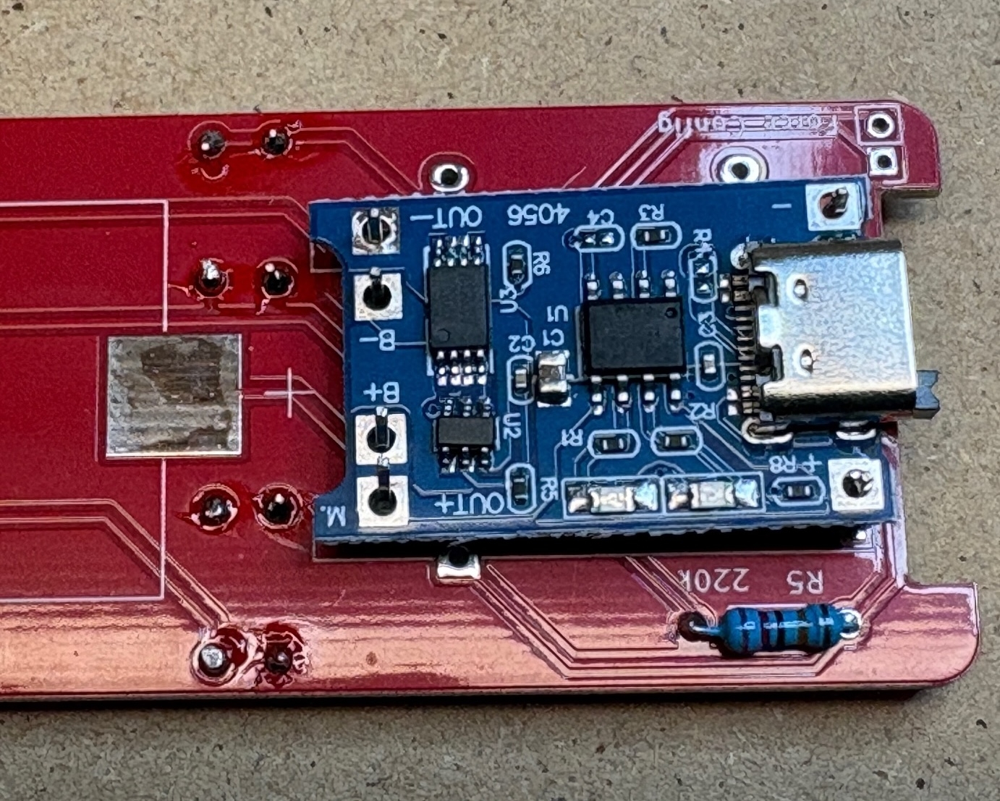
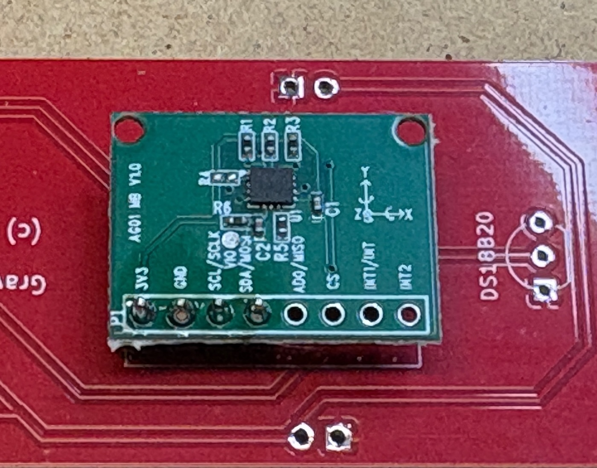
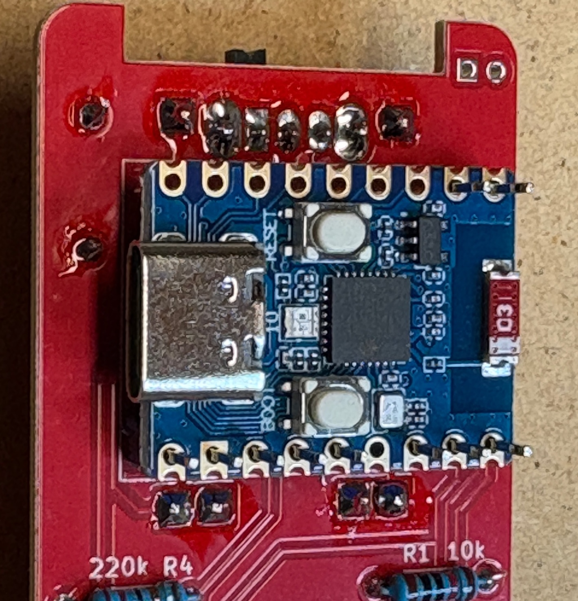
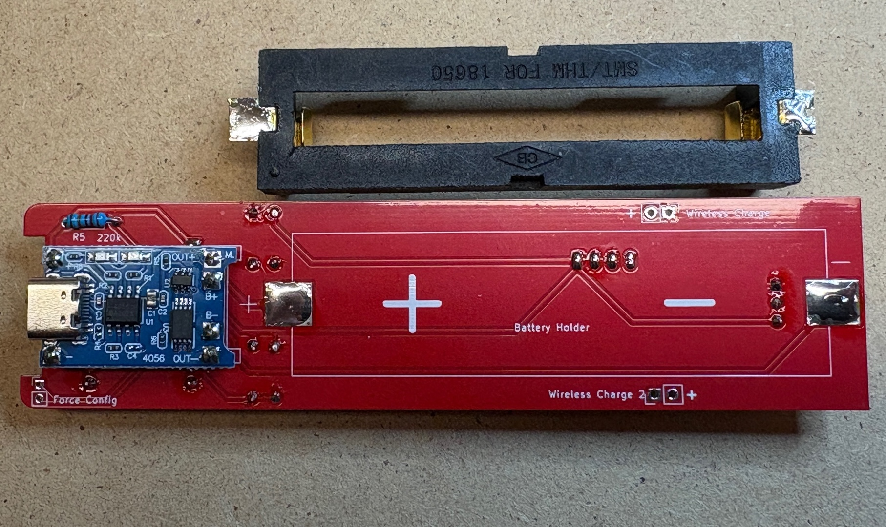
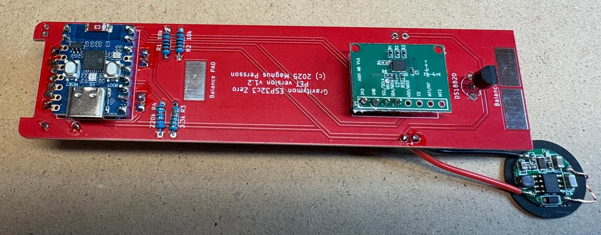
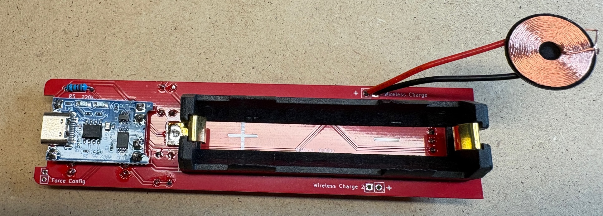

.. _building_device:

Building a device
################# 

This is an instruction on how to build a device based on the Gravitymon PCB, the instructions shows the 
PET PCB but the steps are the same for the PILL PCB.

I recommend to use the v1.2 of the Gravitymon PET PCB which has been converted to use 3.3V for all sensors. 
Older PCB use the standard iSpindel schematics which will put 5V when charging on the GPIO pins which can damage the ESP32c3. An easy fix 
for the older PCB is to connect the tempsensor pull-up to 3.3V on the ESP32 (use the inner hole) on the PCB.

Step 1 - Gather components
++++++++++++++++++++++++++

First gather all the components and check that you have everything needed.

These are the components needed. 

* XL BIG PET Micro Geocaching container (not in picture)
* Gravitymon PCB (Order from PCBWAY)
* Waveshare ESP32c3 Zero board (18-pin board)
* MPU-6050 (GY-521) or ICM-42670-P gyro board
* 18650 battery holder for surface mount (smt)
* 18650 battery (not in picture)
* Wireless Charging reciver and transmitter (XKT510-24)
* Resistor: 2 x 10k 0.25W (R1+R2)
* Resistor: 2 x 220k 0.25W (R4+R5)
* Resistor: 1 x 3.3k 0.25W (R3)
* Charging module TP4056
* Switch (SK12D07VG3)
* Dallas DS18B20 temperature sensor

.. image:: images/hw/1_material.jpeg
  :width: 600
  :alt: Overview of components

Step 2 - Mount switch
+++++++++++++++++++++

First step is to mount and solder the switch, this will be under the charging module so make 
ure its placed on the correct side. 

.. image:: images/hw/2_switch.jpeg
  :width: 600
  :alt: Mount the switch

Step 3 - Mount resistors
++++++++++++++++++++++++

Next is to mount and solder all the resistors, these are placed on the side where the value is 
located as shown in the image below.

.. image:: images/hw/3_resistor.jpeg
  :width: 600
  :alt: Mount resistors

Step 4 - Mount pins for ESP32
+++++++++++++++++++++++++++++

The pins for the ESP32 needs to be mounted and soldered before the LiPo charger module is mounted 
or you will not be able to solder the pins under the module.

.. image:: images/hw/4_pins_esp.jpeg
  :width: 600
  :alt: Mount pins for ESP32

Step 5 - Mount LiPo charger
+++++++++++++++++++++++++++

Mount and solder the lipo charger, total 6 pins are needed and this should be placed on top of the switch.

Step 6 - Mount gyro pins 
++++++++++++++++++++++++

The gyro pins needs to be mounted so they are flush with the PCB since the battery holder goes on 
top of the gyro. This also applies the temperature sensor.

.. image:: images/hw/6_gyro_pins.jpeg
  :width: 600
  :alt: Mount gyro pins

Step 7 - Mount gyro & temperature sensor 
++++++++++++++++++++++++++++++++++++++++

Mount and solder the gyro and temperature sensor. Try to mount them leveled with the PCB, a tip is 
to place something flat between the gyro and PCB to ensure they are leveled. 

Mount the temperature sensor from the same side as the gyro (not yet shown in the images) as 
indicated by the silkscreen.

Step 8 - Mount ESP32
++++++++++++++++++++

Next is mounting the ESP32 board, the USD connectior should be facing the edge where the resistor 
is located and make sure the USB connector is up.

Step 9 - Mount battery holder
+++++++++++++++++++++++++++++

To mount the battery holder first add some solder to the pads and connectors of the battery holder. 
It might be neccesarry to cut of a piece of the negative connector on the holder. Then solder the 
holder to the PCB which will be much easier now that there is solder on both sides.

Try to mount the battery holder as far down as possible, this will give angle in water.

Step 10 - Mount coil
++++++++++++++++++++

Finally its time to mount the coil for wireless charging (optional)

Completed
+++++++++

Now all the components are mounted so its time to flash the software and test / calibrate the device. 

Depending on the mounting of the battery holder and also the weight of the battery you might need to 
add some weights to the lower balance pads. I have got batteries that weigh between 40 and 44g. In this 
build I had to add 1.5g to the solder pads to get a 24 degree angle in water. Typically any starting value 
between 20-30 degrees is acceptable, but between 20-25 degrees are optimal.

