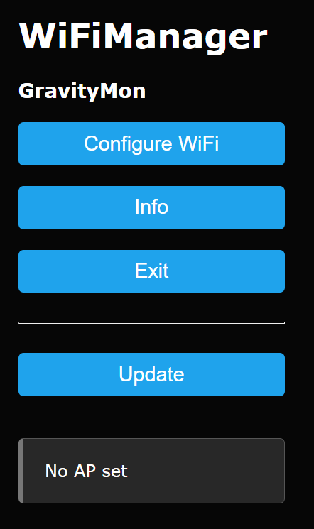

.. _installation:

Installation 
------------

You have these 3 options for flashing this firmware. 

* Brewflasher via USB serial
* Esptool via USB serial
* iSpindel web interface

Brewflasher
===========

The preferred option for flashing GravityMon is using BrewFlasher, its a tools that support many brewing related firmwares for ESP8266 and ESP32. This works 
on both Windows and Mac. You can download the latest version from here: `Brewflasher <https://www.brewflasher.com/>`_ there is also a web based version 
available here `Brewflasher WEB <https://web.brewflasher.com/>`_.

.. image:: images/brewflasher.png
  :width: 600
  :alt: Serial output

Binaries
********

In the /bin directory you will find 3 different firmware builds;

* **firmware.bin**

  This is the standard release build (preferred version) 

* **firmware-perf.bin**

  This version also submits performance data to an influx database with detailed execution times.

* **firmware32.bin**

  This is the standard release build for an ESP32 variant. When flashing an ESP32 you also need the **partition32.bin** file that outlines the flash memory structure. Due to 
  the size of the firmware we are using a custom partition setup.

In these versions all the html files are embedded in the binaries. The file system is currently only used for storing 
the configuration file. 

If the software becomes so large the html files can be moved to the file system, but this is not enabled by 
default (see compiling for details). This approach makes installation much easier and ensure that html files 
and code is in sync.

Esptool
=======

The other option for flashing esp8266 device is via the official esptool. Documentation can be found 
here; `esptool home page <https://docs.espressif.com/projects/esptool/en/latest/esp32/>`_

Windows 10 should install a driver for the USB -> Serial automatically when you connect a esp8266.

The basic command for flashing on Windows is;

``esptool.py --port COM4 write_flash 0x0 firmware.bin``

If there are issues you can try do erase the flash first using this command;

``esptool.py --port COM4 erase_flash``

iSpindel
========

If you already have the device flashed with iSpindel firmware you can go into the configuration mode where you will find
an option for updating firmware. The option is under the maintenance menu.

Select the esp8266 version of the firmware called firmware.bin and press upload. 

Updating firmware 
=================

You can use the above options for updating the firmware as well. But if you want to do updates without connecting the USB cable these 
are your options.

OTA Option
**********

You can use the OTA option by adding this URL to your configuration and when the device starts up in configuration mode it 
will check for a new version and if it finds a newer version it will do an update.

``https://mp-se.github.io/gravitymon/release/``

Manual update
*************

When the device in is configuration mode you can manually update with a new firmware. Just open this URL in the web 
browser and select the firmware.bin file that corresponds to the version you want to flash. 

``http://<device_name>/firmware.htm``

.. _serial_monitoring:

Serial Monitoring
=================

To check output from the device (logs) there are several tools out there. I found this simple tool in the Windows Store called ``Serial Port Monitoring``. 
Just select a baud rate of 115200, 8N1.

.. image:: images/serial.png
  :width: 800
  :alt: Serial output

.. _setup_wifi:

Configuring WIFI
================

When the device is flashed it will need to have WIFI configuration in order to work. If you have used other software on 
the device its possible that wifi settings already exist.

If this is not configured in the device it will create an wireless access point called `GravMon`. The default password is `password`.

Connect to this AP and enter the SSID and password you want to use. If the web page don't open automatically you can enter the following address 
in the browser: **http://192.168.4.1**

Before pressing save on the network information, make a note of the devicename that is shown on the screen, this will be the name that is used 
in the next step to access the configuration pages. The link would look like this: **http://gravitymon56EA34.local**

.. note::
  When selecting a SSID in the list this will be populated in both wifi fields. This is the behaviour of the wifi manager library that I'm using,
  in the future this is planned to be moved to the normal UI.

Under wifi settings you can define a primary and secondary wifi SSID. The secondary will be used in case the primary fails. If the secondary is 
successful then it will be used as primary. *The second wifi setting is optional and not needed.*

.. _setup_ip:

Finding the device adress
=========================

Once the wifi network settings have been added then the device will reboot and connect to your network. If the blue led is flashing then it's up and running and is ready to be configured. 

If your computer supports mDNS the address you saw before can be used in your web browser to connect to the device. Windows does not have the best support for mDNS so if you are having issues 
with finding the network name you can try the following:

* Check your wireless router for the IP address and use that to connect instead, for example; http://192.168.1.56
* Download an IP scanner / Port Scanner on your Windows computer or mobile device and use that to find what devices are listening on port 80.

Once you can access the user interface then proceed to the next step.
