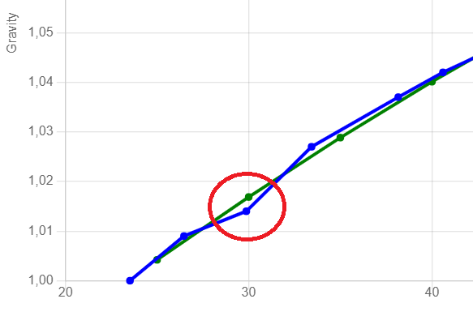

Q & A
#####

User interface does not render correctly
----------------------------------------

Since the user interface is built using bootstrap v5 the device requires access to the internet 
to download required javascript and css files. Due to size it would not be possible to store these
on the device. Make sure the device can access: https://cdn.jsdelivr.net/npm/bootstrap

Data is not populated in the fields
------------------------------------

The user interface uses JQuery to fetch data from the device. This javascript library needs to be downloaded 
from the internet.  Due to size it would not be possible to store these on the device. Make sure the 
device can access: https://code.jquery.com

Also ensure that any security tools does not block the execution of these features.

My device is no going in to sleep after fully charged
-----------------------------------------------------
- Calibrate the device in the web interface
- Check the angle/tilt. If the device is reporting 90 degrees then its not going into sleep. Tilt the device and check if sleep works.
- Check in reported voltage of the battery in the web interface. If this is higher than 4.15V the device believes its being charged. In that case adjust the voltage factor under hardware so the voltage drops below 4.15V.
- Check if the `always on` option is activated in the web interface.

My device reports a temperature of -273C or -491F
-------------------------------------------------
- The DS18B20 temperature sensor cannot be found and this is the default value reported in this case.
- Check the orientation of the sensor and the soldering.

Calibration error (unable to find a valid formula)
--------------------------------------------------
If you have issues to get a calibration formula. When a formula has been created the device always tries to validate the formula against the supplied values and if there is a to high deviation on any of the values then the formula will be rejected.

The image here shows such a case, one of the values is out of bounds. 

To fix these this you can;

- remove the value from the list (setting the angle to zero will do that)
- change the advanced setting (Formula max deviation) to a higher value and save the values again. 

In the case above this parameter was changed from 1.6 SG to 4 SG and the formula was accepted. The deviation on this point was just above 3 SG. 

How can I filter data on influxdb without needing to know the time range
------------------------------------------------------------------------

You can use any of the available fields to enter your custom data. An option is to use the token fields to 
add some custom information to identify your brew. This can then be used to filter your data in influxdb.

When you switch brews you need to go in and change the token to identify the brewing session.

Change the format template for the influx target to include the token field. Now you will have an 
field called event that you can filter on in influx.

.. code-block::

  gravity-format=${gravity-unit} gravity=${gravity},corr-gravity=${corr-gravity},
  angle=${angle},temp=${temp},battery=${battery},rssi=${rssi}

to

.. code-block::

  gravity-format=${gravity-unit} gravity=${gravity},corr-gravity=${corr-gravity},
  angle=${angle},temp=${temp},battery=${battery},rssi=${rssi},event=${token}

Device only reporting data once
-------------------------------

If the device does not wake up from a deep sleep, this is most likely a hardware problem,
check the resistor / diode between D0 and RST. Wrong value can stop the device from wakeing up.
